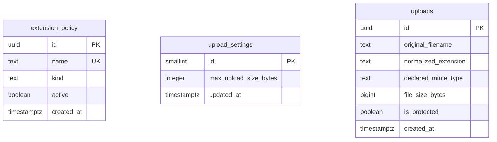

# extension-blocker

파일 확장자 차단 정책 설정과 실제 파일 업로드 검증 과제 프로젝트

<br />

## 기술 스택

<br />

#### 🖥️ Frontend

<span>
  
  
  
  
</span>

<br />

#### 🏗️ Backend

<span>
  
  
  
</span>

<br />

#### 🗄️ Database

<span>
  
</span>

<br />

#### 🧪 Testing

<span>
  
</span>

<br />

#### ☁️ Infra / DevOps

<span>
  
  
</span>

<br />

## 사용법

<br />

### 확장자 정책

고정 확장자 7종(`bat`, `cmd`, `com`, `cpl`, `exe`, `scr`, `js`)은 체크박스로 즉시 켜고 끔, 커스텀 확장자는 단일 입력 또는 쉼표로 구분한 일괄 입력으로 추가

<br />

**일괄 입력 예시**

```
sh, dll, my-ext, tar.gz
```

- `sh`, `dll`, `tar.gz`: 형식이 올바르면 등록, 고정 확장자와 겹치면 해당 고정 확장자 자동 활성화
- `my-ext`: 허용되지 않는 문자 포함으로 형식 오류, 오류 항목이 하나라도 있으면 전체 미반영

<br />

**`extignore.txt` 가져오기와 내보내기**

가져오기는 파일을 줄 단위로 읽어 일괄 입력과 동일하게 검증, 내보내기는 활성 고정 확장자와 커스텀 확장자를 한 줄씩 담아 다운로드

예시: 고정 확장자 `exe` 활성화, 커스텀 확장자 `dll`, `sh` 등록 상태에서 내보내기 실행 시

```
exe
dll
sh
```

<br />

**정책 초기화**

확인 절차 후 커스텀 확장자 전체 삭제와 고정 확장자 전체 비활성화, 업로드 최대 크기 설정은 유지 대상

예시: `고정 exe 활성화, 커스텀 dll, sh, 최대 크기 10MB` 상태에서 초기화하면 `고정 없음, 커스텀 없음, 최대 크기 10MB 유지`로 변경

<br />

**샘플로 시험하기**

업로드 목록의 보호 시드 파일을 내려받아 위 기능을 바로 시험 가능

| 샘플 파일 | 결과 |
|---|---|
| `guideline.md` | 위 사용법을 정리한 안내 문서 |
| `extignore.valid-200.txt` | 정상 형식, 커스텀 확장자 200개까지 반영 |
| `extignore.limit-201.txt` | 형식은 정상이나 200개 제한 초과로 반영 실패 |
| `extignore.invalid-chars.txt` | 허용되지 않는 문자 포함으로 전체 반영 실패 |

<br />

### 업로드 크기 제한

1/5/10/20/50MB 중 선택, 변경 즉시 저장되고 이후 업로드부터 적용

예시: 최대 크기 10MB 상태에서 12MB 파일 업로드 시도 시 크기 초과로 거부

<br />

### 파일 업로드

파일 선택 후 업로드 실행, 서버가 파일명, 확장자 정책, 크기, ClamAV 검사 순으로 검증해 가장 먼저 걸린 사유 하나만 표시, 통과한 파일만 저장

예시: 확장자 정책에서 `exe` 차단 중인 상태에서 `report.exe` 업로드 시도 시 차단 사유 표시

<br />

### 업로드 목록

업로드 성공 시 목록에 반영, 원본 파일명, 크기, 업로드 시각 확인과 다운로드, 삭제 가능(보호 시드로 등록된 샘플 파일은 삭제 불가)

<br />

## 배포

| 항목 | 값 |
|------|-----|
| 사이트 | https://34-64-155-12.nip.io/ |
| GitHub | https://github.com/seungjoonH/extension-blocker |
| 인프라 | GCP Compute Engine (`e2-small`), Docker, Caddy, Supabase Cloud |

GCE VM 외부 IP를 `nip.io` 호스트명으로 연결하고 Caddy가 Let's Encrypt HTTPS를 발급한다. IP(`34.64.155.12`)가 유지되는 한 URL(`34-64-155-12.nip.io`)도 함께 유지된다

```bash
# 로컬 Docker 검증
docker compose -f docker-compose.prod.yml up --build

# GCP push + VM
export GCP_PROJECT_ID=extension-blocker-1
./deploy/gcp/build-and-push.sh
./deploy/gcp/provision-vm.sh
```

헬스 체크

```bash
curl -s https://34-64-155-12.nip.io/api/health
# {"ready":true} 이면 ClamAV 포함 준비 완료
```

배포 절차: [`docs/deploy/GCP.md`](docs/deploy/GCP.md)

<br />

## 개발

<br />

### 로컬 개발

```bash
npm install
npx supabase start
cp .env.example .env   # Supabase local credentials
npm run dev
```

<br />

### 테스트

```bash
npx supabase start
npm test
```

<br />

### Supabase prod 마이그레이션

```bash
npx supabase login
npx supabase link --project-ref <PROJECT_REF>
npx supabase db push
```

`<PROJECT_REF>`는 Supabase 대시보드 Project Settings → General에서 확인한다

<br />

## Table schema

DDL 원본: [`supabase/migrations/`](supabase/migrations/)



<br />

### `extension_policy`

고정 확장자와 커스텀 확장자를 하나의 테이블로 관리

| 컬럼 | 타입 | 제약 |
|------|------|------|
| `id` | `uuid` | PK, `default gen_random_uuid()` |
| `name` | `text` | NOT NULL, **UNIQUE** |
| `kind` | `text` | NOT NULL, `check (kind in ('fixed', 'custom'))` |
| `active` | `boolean` | NOT NULL, default `true` |
| `created_at` | `timestamptz` | NOT NULL, default `now()` |

추가 제약

- `extension_policy_custom_always_active`: `kind = 'fixed' or active = true` (커스텀은 존재 자체가 차단 의미)
- 시드: 고정 7종(`bat`, `cmd`, `com`, `cpl`, `exe`, `scr`, `js`)은 `active = false`로 삽입

인덱스: `UNIQUE(name)` 제약이 생성하는 인덱스를 중복 조회에 사용

<br />

### `upload_settings`

업로드 최대 크기 정책(싱글턴)

| 컬럼 | 타입 | 제약 |
|------|------|------|
| `id` | `smallint` | PK, `default 1`, `check (id = 1)` |
| `max_upload_size_bytes` | `integer` | NOT NULL, `check` 허용값: 1/5/10/20/50 MB |
| `updated_at` | `timestamptz` | NOT NULL, default `now()` |

시드: `max_upload_size_bytes = 10485760` (10MB)

<br />

### `uploads`

업로드 성공 건 메타데이터, Storage 객체 키는 `id`(UUID)와 동일, 경로는 `uploads/{id}`로 고정

| 컬럼 | 타입 | 제약 |
|------|------|------|
| `id` | `uuid` | PK (애플리케이션이 생성, Storage 키와 동일) |
| `original_filename` | `text` | NOT NULL |
| `normalized_extension` | `text` | nullable |
| `declared_mime_type` | `text` | nullable, `char_length <= 255` |
| `file_size_bytes` | `bigint` | NOT NULL, `>= 0` |
| `is_protected` | `boolean` | NOT NULL, default `false` (보호 시드 삭제 방지) |
| `created_at` | `timestamptz` | NOT NULL, default `now()` |

<br />

### Storage

| 버킷 | public | 용도 |
|------|--------|------|
| `uploads` | `false` | 업로드 파일 저장 (service role만 접근) |

<br />

### RPC 참고

커스텀 확장자 추가, 일괄 등록, 정책 초기화는 `add_custom_extension`, `add_custom_extensions_batch`, `reset_extension_policy` RPC로 처리, 정의는 `0004`, `0006` 마이그레이션 참고
