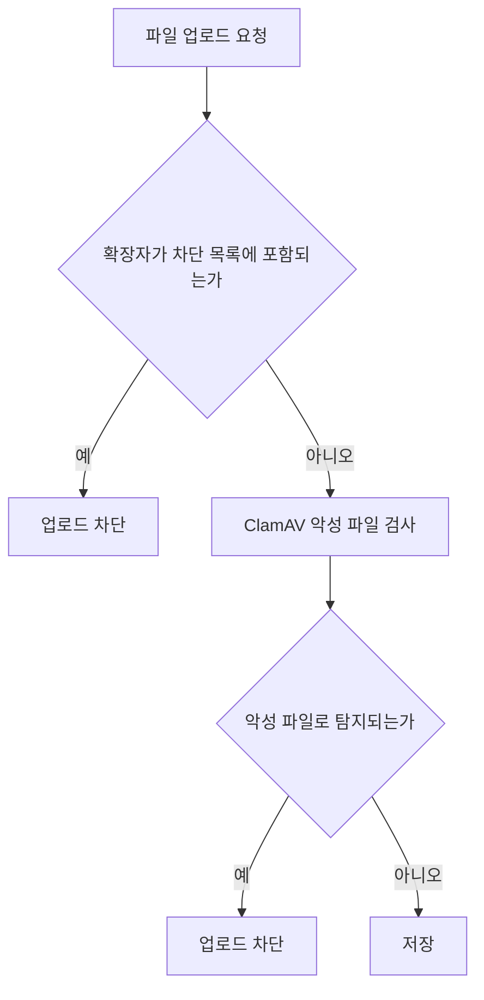
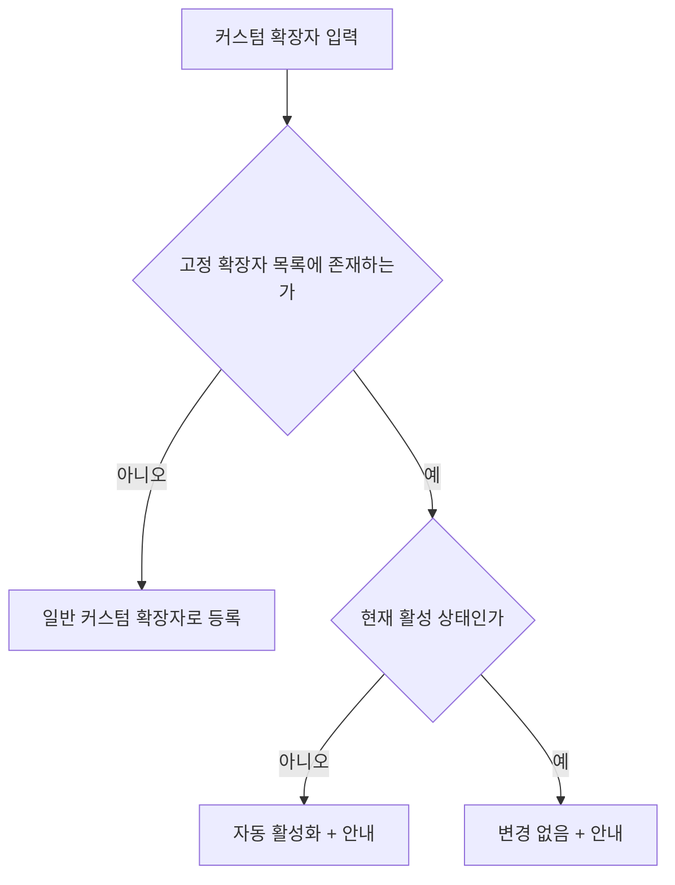

# Considerations

`docs/과제_파일업로드_AI개발.md` 3장의 고려사항 목록을 기준으로, 각 항목을 구현했는지 여부와 그 근거를 정리합니다. 반영 시점(사전에 계획했는지, 검증 단계에서 새로 발견했는지)과 무관하게 모든 항목을 같은 형식(항목 제목 → 원문 인용 → 판단 → 반영 내용)으로 기록합니다. 실제 동작을 중심으로 쓰고, 어느 파일이 이를 구현하는지 같은 코드 디테일은 다루지 않습니다. 더 상세한 판단 근거는 각 항목이 가리키는 [`REQUIREMENTS.md`](specs/REQUIREMENTS.md) 절에서 확인할 수 있습니다.

## 3-1. 검증/보안 관점

### 확장자 신뢰 여부

> 확장자만 믿어도 되는가? (실제 파일 내용/시그니처(매직 넘버)와의 불일치 — 예: `report.jpg` 인데 실제로는 실행 파일)

**판단**: 구현(매직 넘버 직접 판별은 제외)

**반영 내용**

- 업로드 파일에 두 단계 검사 적용
  - 확장자 검사: 차단 목록에 포함된 확장자의 업로드 차단
  - ClamAV 검사: 확장자 검사를 통과한 파일의 악성 여부 확인
- 두 검사를 모두 통과한 파일만 최종 저장

**매직 넘버 직접 판별 제외 이유**

파일의 실제 형식을 직접 판별하려면 파일 형식별 시그니처를 지속적으로 추가하고 관리해야 합니다. 제한된 형식만 판별하는 로직을 직접 구성하기보다 확장자 차단 정책과 ClamAV 악성 파일 검사를 적용하는 편이 구현 범위와 유지보수 부담에 적절하다고 판단했습니다. 다만 이 방식은 확장자와 실제 파일 형식의 일치까지 보장하지 않으며, 확장자 정책 위반과 악성 파일 여부만 확인합니다.

| 파일 | 확장자 차단 목록 | ClamAV 검사 | 업로드 |
|---|---|---|---|
| `report.jpg` | 미포함 | 악성 파일 탐지 | 차단 |
| `tool.exe` | 포함 | 검사하지 않음 | 차단 |
| `tool.exe` | 미포함 | 이상 없음 | 허용 |

### 대소문자와 이중 확장자

> 대소문자 / 이중 확장자 (`file.exe.txt`, `file.PDF`, `.tar.gz`)

**판단**: 구현

**반영 내용**

- 대소문자 구분 없이 소문자로 통일해 비교
- 복합 확장자(`tar.gz` 등)도 등록 가능, 등록값이 파일명 끝부분과 점 경계 기준으로 일치하는지 확인
- 파일명 중간에만 등장하는 확장자 형태 문자열은 차단 판단에서 제외

예시:

| 차단 목록 | 파일명 | 결과 |
|---|---|---|
| `tar.gz` | `backup.tar.gz` | 차단(복합 확장자 일치) |
| `tar.gz` | `backup.gz` | 허용(끝부분 불일치) |
| `gz` | `backup.tar.gz` | 차단(마지막 확장자 일치) |
| `pdf` | `file.PDF` | 차단(대소문자 무관) |

파일명 중간에 오는 문자열이 확장자로 오인되지 않는지는 별도로 확인했습니다.

| 차단 목록 | 파일명 | 최종 확장자 | 결과 |
|---|---|---|---|
| `exe` | `file.exe.txt` | `txt` | 허용(`exe`는 파일명 중간에만 존재) |
| `txt` | `file.exe.txt` | `txt` | 차단(최종 확장자 일치) |

### 특수한 파일명

> 확장자 없는 파일, 점(.)으로 시작하는 파일(`.env`), 매우 긴 파일명

**판단**: 구현

**반영 내용**

- 파일명에 점이 아예 없거나 마지막 문자가 점인 경우 확장자 없음으로 판단해 차단 대상에서 제외
- 점으로 시작하는 파일도 예외 없이, 등록된 확장자와 파일명 끝부분이 정확히 일치할 때만 차단
- 파일명 길이(확장자 포함 255바이트, UTF-8 기준) 초과 시 화면에서 먼저 안내하고, 저장 단계에서도 최종 거부

예시:

| 차단 목록 | 파일명 | 결과 |
|---|---|---|
| `env` | `.env` | 차단(끝부분 일치) |
| `env` | `.env.local` | 허용(끝부분 불일치) |
| (없음) | `README` | 허용(확장자 없음) |
| (없음) | `Makefile` | 허용(확장자 없음) |
| (없음) | 255바이트 초과 파일명 | 거부(길이 초과) |

### 입력값 검증

> 확장자 입력값 검증 (특수문자·공백·유니코드·`.` 포함 여부 정규화)

**판단**: 구현(화면 즉시 검증을 추가로 보강)

**반영 내용**

- 등록값 정규화: 앞뒤 공백 제거, 맨 앞 마침표 하나 제거, 소문자 통일
- 허용 문자: 영문, 숫자, 복합 확장자용 내부 마침표만 허용(하이픈, 언더스코어, 공백, 유니코드는 오류)
- 추가 거부 조건: 마침표 연속(`..`), 정리한 값이 마침표로 시작/종료
- 검증 시점: 화면 입력 즉시 1차 검증, 저장 요청 시 최종 검증(화면 검증을 우회해도 최종 검증이 차단)

**검증 단계에서 확인한 문제**

연속된 마침표에는 전용 안내 문구를 제공하고 화면에서도 미리 걸러야 한다고 이미 정해져 있었지만, 실제로는 모든 형식 오류가 같은 문구로 처리되고 있었습니다. 화면의 사전 검증과 저장 단계의 최종 검증이 각자 다른 기준을 쓰면 한쪽만 고쳤을 때 서로 어긋날 수 있어, 두 곳이 완전히 같은 판단 기준을 쓰도록 정리했습니다. `tar.`처럼 아직 복합 확장자를 마저 입력하는 중일 수 있는 값은, 다음 글자가 더해지면 정상적인 값이 될 수 있으므로 화면에서 성급하게 오류로 표시하지 않습니다. 이 경우의 최종 판단은 저장을 요청하는 시점에 확정합니다.

예시:

| 입력 | 화면 검증 | 저장 요청 | 안내 또는 결과 |
|---|---|---|---|
| `a..txt` | 즉시 차단 | 전송 없음 | "연속된 마침표는 사용할 수 없습니다." |
| `.EXE` | 통과 | 등록 | `exe`로 저장 |
| `my-ext` | 즉시 차단 | 전송 없음 | "허용되지 않는 형식의 확장자입니다." |
| `tar.`(입력 중) | 보류(오류 표시 없음) | 이 상태로 제출 시 거부 | "허용되지 않는 형식의 확장자입니다." |

### glob 패턴 지원 여부

> 확장자 입력에 glob 패턴(`*`, `?` 등)을 허용할지

**판단**: 검토 후 제외

**검토 내용**

- 리터럴 확장자만으로 표현하기 어려운 차단 규칙도 지원할 수 있음
  - `*.log`: `.log`로 끝나는 파일 전체 차단
  - `tar.*`: `tar.gz`, `tar.bz2` 등 특정 접두 형태의 복합 확장자 차단
- `.gitignore`와 비슷한 방식으로 운영자가 차단 범위를 유연하게 관리할 수 있다는 장점도 확인함

**제외 이유**

> glob을 허용하면 등록값의 의미가 단순한 확장자 이름에서 파일명 매칭 규칙으로 바뀝니다. 이에 따라 패턴을 파일명 전체에 적용할지 확장자 부분에만 적용할지, 어떤 문법을 허용할지, 대소문자와 숨김 파일을 어떻게 처리할지 추가로 정의해야 합니다. 또한 `*`, `*.*`처럼 대부분의 파일을 차단할 수 있는 패턴에 대한 제한과, 고정 확장자 목록과 glob 패턴이 겹칠 때의 처리 방식도 별도로 필요합니다.

> 이번 과제의 핵심은 고정 확장자와 커스텀 확장자를 기준으로 한 리터럴 차단 정책과 서버 최종 검증입니다. glob까지 포함하면 확장자 차단 기능을 넘어 파일명 규칙 엔진으로 범위가 확대되고, 요구사항, 화면 구성, 입력 검증과 테스트 범위도 함께 커집니다. 명확한 운영 요구가 없는 상태에서 과제 범위를 불필요하게 확장하지 않기 위해 이번 구현에서는 제외했습니다.

예시:

| 입력값 | 리터럴 확장자 정책 | glob 정책 도입 시 |
|---|---|---|
| `exe` | `.exe` 확장자 파일 차단 | 매칭 대상과 문법 정의 필요 |
| `*.exe` | 등록 불가 | `.exe`로 끝나는 파일 차단 |
| `tar.*` | 등록 불가 | `tar.gz`, `tar.bz2` 등 차단 |
| `*` | 등록 불가 | 적용 방식에 따라 대부분의 파일 차단 가능 |

**향후 도입 조건**

- `.gitignore` 형태의 파일명 규칙 관리 요구 확인
- glob 적용 대상과 지원 문법 확정
- 단독 `*`, `*.*` 등 광범위 패턴 제한
- 일반 확장자와 glob 패턴의 UI 구분
- 고정 확장자와 패턴 중복 처리 기준 확정
- 패턴 검증과 차단 범위에 대한 테스트 보강

### 서버 검증

> 서버 사이드 검증의 필요성 (클라이언트 검증만으로는 우회 가능)

**판단**: 구현

**반영 내용**

- 최신 차단 정책 조회: 업로드 요청을 처리할 때마다 수행(화면 검증 결과와 무관하게 적용)
- 커스텀 확장자 재검증: 길이, 개수, 중복, 고정 확장자 중복 여부를 저장 시점에 다시 확인
- 최종 허용 여부 판단: 저장을 처리하는 단계에서 확정(화면의 즉시 검증은 사용성 개선 목적이며 이 판단을 대신하지 않음)

### 크기와 개수 제한

> 업로드 파일 크기 제한 / 파일 개수 제한

**판단**: 구현

**반영 내용**

- 파일 크기 설정: 관리 화면에서 `1MB`/`5MB`/`10MB`/`20MB`/`50MB` 중 선택, 기본값 `10MB`, 화면과 저장 처리가 같은 설정값 기준으로 검증
- 설정 가능 범위: 서버 절대 상한 이하로 제한
- 크기 초과 파일: 내용 검사 생략, 바로 거부
- 파일 개수: 한 번에 하나만 선택 가능, 다중 파일 전송은 거부

예시:

| 설정 | 파일 크기 | 내용 검사 | 업로드 |
|---|---|---|---|
| `10MB` | `8MB` | 수행 | 허용 |
| `10MB` | `12MB` | 생략 | 거부(설정된 최대 크기 안내) |
| `10MB` | 여러 파일 동시 전송 | 생략 | 거부 |

### 원본 파일명 저장 위험

> 저장 시 원본 파일명 사용 위험 (경로 조작, 실행 가능 위치 저장) 및 대응

**판단**: 구현

**반영 내용**

- 저장 파일명은 원본과 무관한 무작위 값으로 생성하고 원본 확장자는 붙이지 않음, 원본 파일명은 참고 정보로만 저장
- 사용자가 보낸 경로나 파일명은 저장 위치를 정하는 데 사용하지 않아 경로 조작 문자열이 포함돼도 실제 저장 위치에 영향 없음
- 저장 위치: 외부에서 직접 접근할 수 없는 별도 공간으로 제한
- 파일 목록 정책은 초기 비공개에서 공개 공유 데모로 바꿨다. 상세는 다음 절

예시:

| 상황 | 결과 |
|---|---|
| 원본 `보고서.pdf` 업로드 | 무작위 이름으로 저장, 원본명은 참고 정보로만 기록 |
| 원본 파일명에 `../` 포함 | 저장 위치에 반영되지 않음 |
| 같은 이름의 파일을 다시 업로드 | 기존 파일을 덮어쓰지 않고 새로 저장 |

### 업로드 목록 공개와 보호 시드

이번 검증과 공유 과정에서 새로 확정한 항목으로, 원문 인용 없이 판단과 반영 내용만 기록한다.

**판단**: 구현(공개 공유 데모, 시드만 삭제 보호)

**반영 내용**

- 업로드 카드 아래에 목록을 둔다(원본 파일명, `#.#MB` 크기, 업로드 시각, 다운로드, 삭제)
- 누구나 조회와 다운로드가 가능하고, 보호되지 않은 파일은 누구나 삭제할 수 있다
- 보호 시드 4개(`guideline.md`, `extignore.valid-200.txt`, `extignore.limit-201.txt`, `extignore.invalid-chars.txt`)는 삭제할 수 없다. UI에 "고정" 문구는 없고 삭제 버튼만 비활성이다
- 목록에서 시드는 `guideline` → `valid-200` → `limit-201` → `invalid-chars` 순으로 위에 두고, 그 외 업로드는 최신순이다
- `guideline.md`는 일괄 입력, 가져오기/내보내기, 초기화를 예시와 함께 짧게 안내한다
- `extignore` 샘플은 가져오기 시나리오용이다. 한도 내(커스텀 200), 한도 초과(201), 형식 오류(하이픈 등). 가져오기는 파일 내용만 보므로 시나리오용 파일명이어도 `.txt`면 선택 가능하다

**판단 근거**

인증 없이 업로드 저장 여부와 가져오기 시나리오를 확인하려면 목록과 샘플 다운로드가 필요하다. 전체 비공개 대신 공개 데모로 바꾸고, 다시 받을 샘플만 삭제로부터 지킨다.

### MIME 타입 스푸핑

> MIME 타입 스푸핑

**판단**: 구현(신뢰하지 않는 값으로 처리)

**반영 내용**

- 브라우저가 보낸 MIME 타입은 참고 정보로만 기록, 실제 파일 형식을 안다는 뜻으로 다루지 않음
- 확장자 검사와 ClamAV 검사 모두 MIME 타입을 사용하지 않음
- 확장자와 MIME 타입이 달라도 그 자체만으로 차단하거나 경고하지 않음

**MIME 타입을 신뢰하지 않는 이유**

브라우저가 전달하는 MIME 타입은 요청에서 임의로 바꿀 수 있으므로, 업로드 허용 여부를 결정하는 기준으로 사용하지 않았습니다.

예시:

| 상황 | 결과 |
|---|---|
| `report.jpg`의 MIME 타입이 정상적으로 이미지로 전달됨 | 참고 정보로만 저장 |
| `malware.exe`의 MIME 타입이 이미지로 조작됨 | 확장자, ClamAV 검사 결과로만 판단(MIME 타입은 무시) |

## 3-2. 정책/데이터 관점

### 고정과 커스텀의 중복

> 고정 확장자와 커스텀 확장자가 겹칠 때 (예: 커스텀에 `exe` 입력)

**판단**: 구현

**반영 내용**

- 커스텀 입력값이 고정 확장자와 같은 경우 커스텀 목록에는 등록하지 않음
- 해당 고정 확장자가 비활성 상태면 자동 활성화 후 안내
- 해당 고정 확장자가 이미 활성 상태면 상태 변경 없이 안내만 표시
- 자동 활성화된 고정 확장자는 커스텀 확장자 개수(200개 제한)에 포함하지 않음

예시:

| 현재 상태(고정 `exe`) | 입력 | 커스텀 등록 | 고정 확장자 | 안내 |
|---|---|---|---|---|
| 비활성 | `exe` | 미등록 | 자동 활성화 | 자동 활성화 안내 |
| 활성 | `EXE` | 미등록 | 변경 없음 | 기존 활성 상태 안내 |
| 활성/비활성 무관 | `sh`(고정 아님) | 등록 | 변경 없음 | 등록 성공 안내 |

### 확장자 정책 초기화의 범위

이번 설계 과정에서 새로 발견한 항목으로, 과제 원문의 고려사항 목록에는 없어 원문 인용 없이 판단과 반영 내용만 기록한다.

**판단**: 구현(업로드 크기 정책은 제외)

**반영 내용**

- 확인 대화상자 후에만 실행한다. 커스텀 전체 삭제와 고정 전체 비활성화만 수행한다
- 업로드 최대 크기는 초기화 대상이 아니다
- 고정 확장자 저장(Debounce 대기 포함), 커스텀 추가/삭제/일괄 등록이 진행 중이면 초기화 버튼을 비활성화한다

**판단 근거**

업로드 최대 크기는 확장자 차단과 별도 정책이라, 함께 초기화하면 크기 설정까지 의도치 않게 리셋된다. 다른 저장이 진행 중일 때 초기화가 끼어들면 직후 응답이 방금 비운 화면을 다시 채울 수 있어, 다른 영역이 유휴일 때만 허용한다.

### 일괄/단일 모드의 기존 커스텀 중복 처리 비대칭

이번 설계 과정에서 새로 발견한 항목으로, 원문 인용 없이 판단과 반영 내용만 기록한다.

**판단**: 구현(의도적 비대칭)

**반영 내용**

- 단일 모드: 이미 등록된 커스텀과 같으면 오류로 거부한다
- 일괄 모드(쉼표 입력, `extignore.txt` 가져오기 공통): 같은 항목은 조용히 제외하고 나머지만 등록한다

**판단 근거**

단일 모드는 대상이 하나라 중복을 바로 알려주는 편이 낫다. 일괄은 여러 개를 넣는 흐름이라, 일부 중복만으로 전체 요청을 막으면 겹치는 항목을 직접 골라 내야 한다. 겹친 항목만 걸러 나머지를 등록하는 쪽이 대량 등록 맥락에 맞다.

### 일괄 등록과 초기화가 공유하는 동시 처리 순서

이번 설계 과정에서 새로 발견한 항목으로, 원문 인용 없이 판단과 반영 내용만 기록한다.

**판단**: 구현

**반영 내용**

- 일괄 등록과 정책 초기화는 단일 등록과 같은 동시 처리 순서를 공유해, 200개 제한과 삭제/삽입 인터리빙이 깨지지 않게 한다

**판단 근거**

200개 제한은 커스텀 전체 집계다. 등록 경로마다 동시성 제어가 다르면 단일과 일괄이 동시에 들어올 때 한도를 넘길 수 있다. 초기화도 같은 순서를 써야, 삭제 중에 새 등록이 끼어드는 순서를 막을 수 있다.

### 형식 오류 시 전체 실패와 오류 표시 수준

이번 설계와 검증 과정에서 새로 발견한 항목으로, 원문 인용 없이 판단과 반영 내용만 기록한다.

**판단**: 구현(전체 실패, 사유 구분 없는 플랫 목록, 모드 무관 인라인 표시)

**반영 내용**

- 일괄 입력과 `extignore.txt` 가져오기에서 형식 오류가 하나라도 있으면 부분 반영 없이 전체를 중단한다. 화면 사전 검증에서 걸리면 API를 호출하지 않고, 서버도 저장하지 않는다
- 규칙별 사유는 나누지 않고, 문제 항목만 한 목록으로 안내한다(예: "올바르지 않은 항목이 있습니다: sqlite-wal, bad-ext")
- 가져오기 오류는 단일/일괄 모드와 무관하게 확장자 카드 인라인에 표시한다. 일괄 영역에만 두면 기본 단일 모드에서 안 보인다

**판단 근거**

형식 오류는 원문을 고쳐야 통과한다. 정상 항목만 일부 저장하면 반영 범위를 알기 어렵고, 항목별 사유 표는 일괄 UX에 비해 무겁다. 가져오기 버튼은 모드와 무관하게 보이므로 오류 표시도 같은 범위에 둔다.

### 가져오기/내보내기 파일명(`extignore.txt`)

이번 설계와 검증 과정에서 발견한 항목으로, 원문 인용 없이 판단과 반영 내용만 기록한다.

**판단**: 구현(`extignore.txt`로 확정)

**반영 내용**

- 초기 후보 `.extignore`는 숨김 파일이라 선택창에서 고르기 어렵고, `accept` 매칭도 불안정하다
- `.gitignore`형 이름은 주석(`#`)이나 glob을 지원할 것이라는 오해를 부른다
- 내보내기 기본 파일명은 `extignore.txt`로 통일한다. 가져오기 `accept`는 `.txt,text/plain`이다
- 내용 규칙은 일괄 입력과 같다(줄 단위 리터럴). 보호 시드처럼 시나리오용 다른 `.txt` 이름도 내용만 맞으면 가져올 수 있다

**판단 근거**

숨김/gitignore형 이름은 선택 UX와 기대 문법을 해친다. 문법은 리터럴로 두고 파일명만 일반 `.txt`로 맞춘다.

### 배치 자동 활성화 시 포커스 대신 요약 안내

이번 설계 과정에서 새로 발견한 항목으로, 원문 인용 없이 판단과 반영 내용만 기록한다.

**판단**: 구현

**반영 내용**

- 단일 모드: 고정 확장자 자동 활성화 시 해당 항목으로 포커스 또는 시각적 강조를 이동한다
- 일괄 모드: 개별 포커스 없이 "exe, bat 활성화됨"처럼 요약 문장으로만 안내한다

**판단 근거**

단일 모드는 대상이 최대 하나라 포커스 이동이 자연스럽다. 일괄은 여러 고정 확장자가 한꺼번에 켜질 수 있어, 어디로 포커스를 옮길지 모호하고 순회하면 흐름만 방해한다.

### 변경 이력 관리

> 정책 변경 이력/감사(누가 언제 무엇을 바꿨는지)의 필요 여부

**판단**: 후순위로 분리(현재 범위에서 제외)

**반영 내용**

- 현재 저장 범위: 정책의 최신 상태만 저장, 변경 이력은 기록하지 않음

**정책 변경 이력 제외 이유**

정책이 언제 어떻게 바뀌었는지 기록해두면 문제를 추적할 때 유용하지만, 이번 과제의 핵심은 정해진 정책이 업로드에서 실제로 지켜지는지를 확인하는 것이라 우선순위를 낮게 잡았습니다.

**향후 확장 방향**

- 변경 이력의 별도 저장
- 조회 화면 제외
- 변경 주체 기록 제외(인증이 없어 식별 불가)
- 일정 기간 경과 후 삭제

### 제한값의 근거

> 200개 / 20자 등 제한의 근거와 초과 시 UX

**판단**: 구현(제한값 자체의 근거는 검증 단계에서 보강)

**반영 내용**

초과했을 때의 사용자 경험은 처음부터 갖추어져 있었습니다.

- 20자를 넘으면 더 입력되지 않고 현재 글자 수를 계속 표시
- 단일 모드에서 200개에 도달하면 입력창은 그대로 둔 채 추가 버튼만 비활성화하고, 기존 항목을 지워야 한다고 안내
- 일괄 입력과 `extignore.txt` 가져오기에서 처리 후 200개를 초과하면 저장하지 않고, 확장자 카드 인라인 오류로 안내한다(사용자가 목록을 줄여야 하는 정책 오류)
- 화면 검증을 우회해도 저장 단계에서 같은 기준으로 다시 거부한다

다만 검증 단계에서 다시 짚어보니, 왜 하필 20자와 200개인지에 대한 근거는 남아 있지 않았습니다. 아래 표는 이번 검증 단계에서 새로 정리한 근거입니다.

| 값 | 근거 |
|---|---|
| 20자 | 이 문서에 등장하는 복합 확장자 예시(`tar.gz` 6자, `env.local` 9자, `module.css` 10자) 중 가장 긴 값의 약 2배. 목록 항목은 줄임표 처리를 하지 않음 |
| 200개 | 페이지 분할, 검색 기능 없이 화면에서 확인 가능한 범위. 실측 성능은 다음 항목("대량 조회 성능") 참고 |

두 값 모두 이 검토 결과 무리가 없다고 판단해 그대로 유지했습니다. 이 근거는 검증 단계에서 사후적으로 확인한 것이며, 최초 설계 시점의 기준은 아닙니다.

### 대량 조회 성능

> 대량(수백 개) 확장자 조회/저장 시 성능·인덱스 고려

**판단**: 조회 성능 구현 확인(별도 조회 인덱스 없음, 저장 성능은 측정 범위 밖)

**반영 내용**

- 커스텀 확장자 컬럼: 중복 방지를 위한 제약 외에 별도 조회 성능용 인덱스는 두지 않음

**실측 결과**

이 결정이 실제로도 괜찮은지 확인하기 위해 검증 단계에서 조회 성능을 직접 측정했습니다. 저장(등록) 자체의 속도는 이번 측정 범위에 포함하지 않았습니다.

| 데이터 규모 | 측정 항목 | 인덱스 없음 | 인덱스 추가 후 |
|---|---|---|---|
| 실제 운영 규모(207개) | 전체 정책 조회 | 0.25ms | 미측정 |
| 실제 운영 규모(207개) | 커스텀 확장자 개수 확인(등록 시 200개 제한 검사에 사용) | 0.04ms | 미측정 |
| 가상 대량 시나리오(30만 개) | 커스텀 확장자 개수 확인 | 33.6ms | 52.9ms |

실제 운영 규모에서는 두 조회 모두 1ms를 넘지 않을 만큼 빨라, 인덱스를 추가한 뒤의 속도까지 측정할 필요는 없다고 판단했습니다. 인덱스를 추가했을 때 실제로 어떤 효과가 있는지는 실제 상한을 훨씬 넘는 가상 시나리오(30만 개)에서 확인했는데, 오히려 더 느려졌습니다. 커스텀 확장자가 전체 데이터의 99.998%를 차지해 선택도가 낮았고, 인덱스가 걸러내는 효과보다 인덱스 자체를 거치는 비용이 더 컸기 때문입니다. 이 측정은 트랜잭션을 이용해 실제 데이터베이스 상태를 바꾸지 않는 방식으로 진행했습니다.

**`REQUIREMENTS.md`를 수정하지 않은 이유**

이 실측은 검증 단계에서 진행한 것이라, `REQUIREMENTS.md`에 남아 있는 원래 판단 이유(실측 이전의 이론적 추정)는 그대로 두었고, 실측 자체와 그 결과는 이 문서에만 기록합니다.

## 3-3. UX/예외 관점

### 차단 메시지

> 차단 시 사용자에게 보여줄 메시지(무엇이, 왜 막혔는지)

**판단**: 구현

**반영 내용**

- 업로드가 차단되면 어떤 파일이 어떤 사유로 차단됐는지 업로드 영역에 바로 표시
- 여러 사유에 동시에 해당해도 가장 먼저 걸린 사유 하나만 표시
- 커스텀 확장자 등록이 차단될 때도 입력 필드 바로 아래에 구체적인 사유 표시

예시:

| 차단 사유 | 메시지에 포함되는 정보 |
|---|---|
| 확장자 차단 | 파일명, 차단된 확장자, 차단 사유 |
| 크기 초과 | 파일명, 현재 설정된 최대 크기, 초과 사유 |
| 악성 파일 탐지 | 파일명, 보안 검사 차단 사유 |

### 네트워크 오류 처리

> 로딩/에러/네트워크 실패 상태 처리

**판단**: 구현

**반영 내용**

- 오류 구분: 네트워크 연결 실패, 요청 시간 초과, 서버가 반환한 처리 오류, 예상하지 못한 서버 오류를 구분해 서로 다른 문구로 안내
- 재시도 방식: 자동 재시도 없음, 사용자가 직접 재시도
- 최초 정책 조회 실패: 알림 대신 화면 안에 재시도 버튼과 함께 안내 표시

예시:

| 오류 상황 | 안내 | 재시도 |
|---|---|---|
| 네트워크 연결 실패(오프라인) | "인터넷 연결을 확인한 후 다시 시도해주세요." | 사용자가 직접 재시도 |
| 요청 시간 초과 또는 무응답 | 서버에 연결하지 못했다는 안내 | 사용자가 직접 재시도 |
| 서버가 반환한 처리 오류 | 서버가 전달한 구체적 사유를 그대로 표시 | 사용자가 직접 재시도 |
| 예상하지 못한 서버 오류 | "일시적인 오류가 발생했습니다. 다시 시도해주세요." | 사용자가 직접 재시도 |

### 저장 실패 시 일관성

> 저장 실패 시 화면 상태와 DB 상태의 일관성

**판단**: 구현

**반영 내용**

| 영역 | 화면 반영 시점 | 저장 실패 시 처리 |
|---|---|---|
| 고정 확장자 | 클릭 즉시 | 실제 저장 상태 재조회 후 화면 복구 |
| 커스텀 확장자 | 저장 성공 후 | 기존 화면 상태 유지 |

저장 실패 후에는 실제 저장된 상태로 화면을 다시 맞추는 방식을 목표로 합니다.

### 접근성과 반응형

> 접근성/반응형(선택)

**판단**: 구현

**반영 내용**

- 스크린 리더 대응: 모든 입력 요소에 이름표 연결
- 키보드 조작: 마우스 없이 키보드만으로 모든 기능 사용 가능
- 포커스 이동: 입력 오류, 업로드 실패(차단과 기술적 오류 모두), 항목 삭제 후 관련 요소로 포커스 이동
- 레이아웃: 데스크톱(넓은 화면)에서는 왼쪽 확장자 정책과 오른쪽 파일 업로드를 좌우 2단으로, 좁은 화면에서는 위아래 1단으로 배치. 별도 미디어 쿼리 없이 그리드 레이아웃의 기본 동작으로 처리
- 확장자 정책 열: 업로드 최대 크기를 포함하고, 그 아래 카드에 확장자 설정을 둔다. 카드 안 순서는 단일/일괄 모드 토글 → 가져오기/내보내기/초기화 → 입력(단일 또는 일괄) → 고정 확장자 → 커스텀 목록이다. "확장자 정책"과 "파일 업로드"의 제목과 설명은 각 카드 밖 동일 레벨에 두고, 카드 안의 "확장자" 제목과 설명은 확장자 설정 구역에만 둔다

검증 단계에서 실제 화면을 사용해보며 이 원칙과 어긋나는 부분을 확인했습니다. 성격이 서로 달라 구분해서 기록합니다.

| 구분 | 확인한 문제 | 반영 결과 |
|---|---|---|
| 계획을 변경 | 고정 확장자, 커스텀 확장자, 업로드 크기, 파일 업로드를 한 줄로 이어 두면 커스텀 목록이 길어질수록 업로드 크기와 업로드 영역이 화면 밖으로 밀림 | 왼쪽 확장자 정책(업로드 최대 크기 포함)과 오른쪽 파일 업로드로 재배치. 확장자 카드 안 순서는 모드 토글 → 가져오기/내보내기/초기화 → 입력 → 고정 확장자 → 커스텀 목록 |
| 문서-구현 불일치 | 커스텀 확장자 등록 시 Enter 키로도 제출 가능하도록 정해져 있었지만, 실제로는 추가 버튼 클릭만 동작 | Enter 키 제출 구현 |
| 저장 상태 표시로 인한 레이아웃 흔들림 | 고정 확장자 저장 중 표시가 나타나고 사라질 때 칩 너비가 바뀌며 목록이 흔들림 | 저장 중 표시를 항상 같은 자리를 차지하는 점(dot)으로 바꿔, 나타나고 사라져도 칩 크기가 바뀌지 않도록 함 |
| 검증 오류 문구로 인한 레이아웃 흔들림 | 커스텀 확장자 오류 문구가 나타나거나 사라질 때 그 아래 개수 표시와 목록이 함께 밀림 | 오류 문구가 표시될 자리에 한 줄 분량의 높이를 항상 예약해, 문구가 나타나거나 사라져도 아래 요소가 밀리지 않도록 함 |
| 가져오기 오류 피드백 누락 | 가져오기 오류를 일괄 입력 영역에만 두어, 기본 단일 모드에서는 형식 오류와 한도 초과가 보이지 않음 | 확장자 카드에서 모드와 무관하게 인라인 오류를 항상 표시 |
| 진행 중 버튼 문구로 인한 크기 흔들림 | `추가` ↔ `추가 중...`처럼 문구가 바뀌며 버튼 너비가 흔들림 | 유휴 라벨 너비를 유지한 채 진행 중에는 원형 스피너만 표시(추가, 일괄 등록, 가져오기, 초기화, 업로드, 목록 삭제) |

## 3-4. 운영 관점

### 동시 편집 정합성

> 새로고침/동시 편집 시 정합성

**판단**: 구현(버전 관리, 실시간 동기화는 제외)

**반영 내용**

- 처리 단위: 고정 확장자 변경과 커스텀 확장자 추가/삭제를 각각 독립 요청으로 처리, 정책 전체를 한 번에 덮어쓰지 않음
- 동시 등록 충돌: 같은 값을 동시에 등록하려는 요청이 겹쳐도 하나만 성공
- 새로고침: 항상 최신 정책을 다시 조회
- 다른 탭의 변경: 새로고침 전까지 자동 반영되지 않음

**버전 관리와 실시간 동기화 제외 이유**

여러 사람이 동시에 사용하는 협업 환경을 주요 사용 사례로 보지 않았기 때문에, 버전 비교와 실시간 동기화 기능은 이번 범위에서 제외했습니다.

### 로그와 모니터링

> 로그/모니터링 관점에서 무엇을 남길 것인가

**판단**: 구현(조회 화면, 대시보드는 제외)

**반영 내용**

- 기록 단위: 업로드 요청마다 식별자 부여, 성공/실패 결과와 실패 사유를 정해진 유형(확장자 차단, 크기 초과, ClamAV 탐지/실패, 저장 실패, 요청 형식 오류 등)으로 구분
- 기록 제외 대상: 파일 내용, 실제 저장 위치 등 민감 정보
- 사용자 안내와 내부 기록: 서로 다르게 관리

**조회 화면과 대시보드 제외 이유**

장애를 추적하려면 로그 기록 자체는 필요하지만, 그 로그를 조회하는 화면이나 대시보드는 별도의 운영 UI에 해당합니다. 이번 과제의 핵심은 업로드 정책과 검증이므로, 로그는 남기되 조회 화면은 과제 범위에 비해 우선순위가 낮다고 판단해 구성하지 않았습니다.

### 향후 확장 가능성

> 향후 확장(예: 사용자별 정책, 화이트리스트 방식 전환) 고려 여부

**판단**: 미구현(검증 단계에서 변경 범위만 확인)

**반영 내용**

기존 문서 어디에도 이 항목을 직접 다룬 부분이 없어, 이번 검증 단계에서 처음 확인했습니다.

- **사용자별 정책**으로 확장하려면 지금 없는 인증과 소유권 개념을 새로 도입해야 한다. 지금은 단일 정책만 있어, 사용자별로 나누려면 저장 구조와 요청 권한 확인을 함께 바꿔야 한다. 업로드 목록을 공개 데모로 연 것도 인증 부재 전제라, 소유권을 두면 목록과 삭제 권한도 다시 나눠야 한다. 지금 구조가 이 방향을 막지는 않지만 미리 대비하지도 않았다.
- **화이트리스트 방식 전환**은 설정값 하나를 바꾸는 정도가 아니라 정책의 의미 자체가 뒤집히는 변경입니다. 지금은 등록된 모든 확장자(고정, 커스텀 모두)가 "차단 대상"이라는 같은 의미를 갖는데, 화이트리스트는 반대로 "허용 대상"을 관리하는 방식이라 목록이 비어 있을 때의 기본 동작(지금은 전체 허용, 화이트리스트라면 전체 차단)이 뒤집힙니다. 최소한 지금 정책이 차단 목록인지 허용 목록인지 구분하는 정보와, 그에 따라 판정 방식을 다르게 적용하는 변경이 필요합니다. 지금 구조는 이런 구분을 염두에 두고 만들어지지 않았습니다.

두 확장 모두 지금 범위에서 구현하지는 않았습니다. 필요한 변경 범위만 이번에 파악해 기록해 두었습니다.
