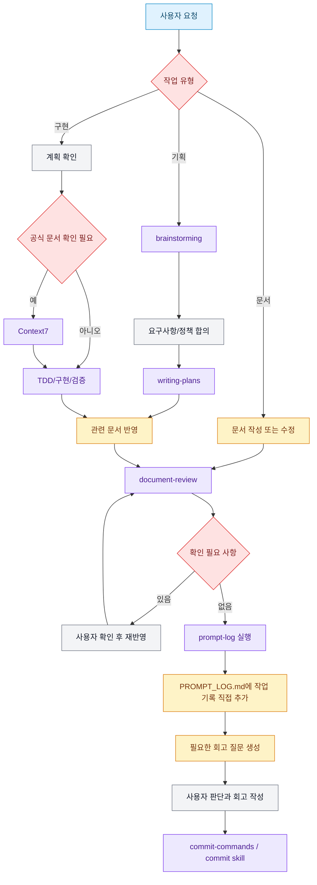

# AI Workflow

## Purpose

프로젝트에서 사용하는 AI 도구와 스킬의 역할, 적용 기준과 실행 순서를 정의한다.

AI가 즉시 구현을 시작하지 않고 요구사항 분석, 계획, 검증과 기록을 거쳐 작업하도록 하는 것을 목적으로 한다.

## Principles

- AI의 제안은 요구사항, 코드, 테스트 또는 공식 문서를 통해 검증한 뒤 반영한다
- 미정의 정책이나 충돌 사항은 AI가 임의로 결정하지 않는다
- 구현 전에 작업 범위와 완료 조건을 명확히 한다
- 코드 변경 후 관련 테스트와 문서의 정합성을 확인한다
- 의미 있는 AI 활용 과정은 추적 가능하게 기록한다
- 검증과 기록이 완료된 변경만 커밋한다

## Tools and Skills

### Claude Code

프로젝트 파일 탐색, 문서 작성, 코드 구현, 테스트 실행과 변경 검토에 사용한다.

설정: `CLAUDE.md`, `.claude/settings.json`, `.claude/skills/`

### Cursor Agent

Claude Code와 동일한 워크플로를 Cursor에서 재현한다. Superpowers, Context7 MCP, 프로젝트 skill, rules, **slash commands**, **hooks**가 `.cursor/`에 구성되어 있다.

설정: `AGENTS.md`, `.cursor/settings.json`, `.cursor/mcp.json`, `.cursor/skills/`, `.cursor/rules/`, `.cursor/commands/`, `.cursor/hooks.json`

| Claude Code | Cursor Agent |
|---|---|
| `CLAUDE.md` | `AGENTS.md` |
| `.claude/skills/` | `.cursor/skills/` (공통 skill 동일, Cursor 전용 skill 추가) |
| `commit-commands` (`/commit`, `/commit-push-pr`) | `.cursor/commands/commit.md`, `commit-push-pr.md` |
| skill invoke (plugin) | `.cursor/commands/` + `.cursor/hooks.json` + `00-skill-invocation-required.mdc` |
| Superpowers `using-superpowers` | `.cursor/skills/using-project-skills/` + Superpowers plugin |
| Superpowers plugin | `.cursor/settings.json` superpowers |
| Context7 MCP | `.cursor/mcp.json` context7 |
| — | `.cursor/rules/` (트리거 강화) |
| `subagent-driven-development` | Task tool (서브에이전트) |

### Superpowers

복잡한 작업을 기획, 계획, 구현, 디버깅과 검증 단계로 나누어 수행하는 데 사용한다.

주요 스킬은 다음과 같다.

- `brainstorming`: 요구사항, 정책과 대안 정리
- `writing-plans`: 구현 순서와 완료 조건 작성
- `test-driven-development`: 테스트 우선 구현
- 디버깅 및 검증 관련 스킬: 문제 원인 분석과 완료 확인

### Context7 MCP

라이브러리 API, 설정 또는 버전별 동작을 공식 문서 기준으로 확인할 때 사용한다.

제품 정책이나 프로젝트 요구사항을 결정하는 용도로 사용하지 않는다.

### `document-review`

Markdown 문서의 문체, 용어, 구조, 형식과 현재 프로젝트 상태의 정합성을 검토한다.

### `prompt-log`

핵심 프롬프트와 AI 활용 과정을 작업 단위로 `PROMPT_LOG.md`에 직접 기록한다. 프로젝트 공통 AI 도구는 문서 상단에 한 번만 관리한다.

판단 근거가 필요한 경우에만 중립적인 회고 질문을 생성하며, 회고 답변은 대신 작성하지 않고 사용자가 직접 작성한다.

### `commit-commands` / Cursor commands

변경사항과 검증 결과를 확인한 뒤 논리적인 작업 단위로 커밋하는 데 사용한다.

- Claude Code: `commit-commands` plugin (`/commit`, `/commit-push-pr`)
- Cursor Agent: `.cursor/commands/commit.md`, `commit-push-pr.md` (skill: `.cursor/skills/commit/`)

### Cursor skill invoke 인프라

Claude Code plugin 수준의 skill 강제 invoke를 Cursor에서 재현한다.

- `.cursor/commands/`: slash command (`/brainstorming`, `/writing-plans`, `/execute-plan`, `/debug`, `/verify`, `/context7`, `/prompt-log`, `/document-review`, `/commit`, `/commit-push-pr`)
- `.cursor/hooks.json`: sessionStart, beforeSubmitPrompt, postToolUse hook으로 skill routing context 주입
- `.cursor/rules/00-skill-invocation-required.mdc`: skill `SKILL.md` Read 강제
- `.cursor/skills/using-project-skills/`: Superpowers `using-superpowers` 대응 및 전체 routing 표

## Workflow

## Trigger Rules

- 신규 기능이나 복잡한 변경은 `brainstorming`과 계획 작성 후 진행한다
- 라이브러리 API나 버전 확인이 필요할 때만 Context7을 사용한다
- Markdown 문서가 변경되면 `document-review`를 실행한다
- 코드 변경으로 문서 내용에 영향이 생긴 경우 관련 문서를 갱신한다
- 정책 충돌이나 의미 변경 가능성이 있으면 사용자 확인을 받는다
- 의미 있는 AI 작업은 `prompt-log`에 기록한다
- 테스트, 문서 검토와 기록이 끝난 뒤 커밋한다

## Related Documents

- [`PROMPT_LOG.md`](./PROMPT_LOG.md): 공통 AI 도구, 작업별 핵심 프롬프트, AI 활용 과정과 사용자의 판단 근거 기록
- [`AI_REVIEW.md`](./AI_REVIEW.md): 프로젝트 완료 후 AI 활용 방식과 결과를 종합적으로 회고