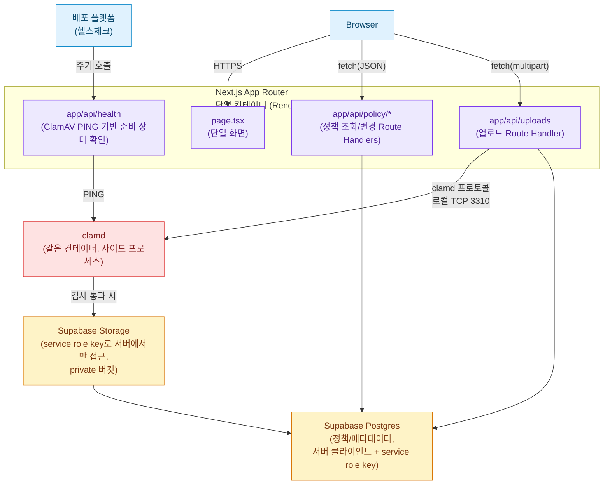

# Design

`docs/specs/REQUIREMENTS.md`와 `docs/specs/PLANNING.md`에서 확정된 요구사항과 화면 흐름을 구현 가능한 기술 구조로 확정한다.

## 1. 문서 목적과 범위

이 문서는 데이터 모델, API, 업로드 검증/저장 흐름, 동시성 처리를 다루는 기술 설계 단계 산출물이다. 화면 구성과 사용자 흐름은 `PLANNING.md`를, 정책과 판단 근거는 `REQUIREMENTS.md`를 따른다. 문서 간 내용이 충돌하면 `REQUIREMENTS.md`, `PLANNING.md`, `DESIGN.md` 순서로 우선한다. 배포 플랫폼 선택, 환경 변수, 실제 리버스 프록시 설정값처럼 배포 환경이 정해져야 확정할 수 있는 구체적인 수치는 `docs/WORKFLOW.md` 7단계(배포와 제출 점검)에서 다룬다.

## 2. 아키텍처 개요



- Next.js 서버 프로세스와 `clamd` 데몬을 같은 컨테이너에서 함께 실행한다(Docker 엔트리포인트 스크립트로 `clamd` 백그라운드 기동 후 `node server.js` 실행). ClamAV는 상시 실행 데몬과 바이러스 정의 DB가 필요해 일반적인 서버리스 함수 환경에서 직접 실행하기 어렵기 때문이다.
- 파일은 항상 서버(Route Handler)를 거쳐 업로드된다. 브라우저가 Supabase Storage에 직접 업로드하지 않는다 — ClamAV 검사가 저장 이전에 끝나야 하기 때문이다.
- Supabase Storage는 private 버킷으로 만들고, service role key는 서버 환경변수로만 보관한다. 클라이언트에는 Supabase 자격 증명을 노출하지 않는다(REQUIREMENTS.md의 "전체 파일 목록 비공개, 저장 UUID/경로 미노출" 요건과 일치).
- `clamd` 포트는 컨테이너 내부(로컬호스트)에서만 접근 가능하고 외부에 노출하지 않는다.

## 3. 데이터 모델

### 3.1 `extension_policy` (고정 + 커스텀 확장자 통합)

```sql
create table extension_policy (
  id          uuid primary key default gen_random_uuid(),
  name        text not null,
  kind        text not null,
  active      boolean not null default true,
  created_at  timestamptz not null default now(),

  constraint extension_policy_name_key unique (name),
  constraint extension_policy_kind_check check (kind in ('fixed', 'custom')),
  constraint extension_policy_custom_always_active check (kind = 'fixed' or active = true)
);

insert into extension_policy (name, kind, active) values
  ('bat','fixed',false), ('cmd','fixed',false), ('com','fixed',false),
  ('cpl','fixed',false), ('exe','fixed',false), ('scr','fixed',false), ('js','fixed',false);

grant select, insert, update, delete on extension_policy to service_role;
```

> 고정 확장자와 커스텀 확장자를 별도 테이블로 나누면 두 테이블 사이의 중복 검사를 애플리케이션 코드가 직접 대조해야 한다. `UNIQUE(name)` 하나로 중복 검사와 교차 검사를 동시에 만족하는 통합 테이블이 더 단순하다고 판단했다. `extension_policy_custom_always_active` 제약으로 `kind='custom'`인 행은 `active=false`로 저장될 수 없다 — 커스텀 확장자는 "존재 = 차단"이라는 의미를 DB가 직접 강제한다. 커스텀 확장자 개수는 `kind = 'custom'`인 행 수로 계산한다(제약 덕분에 `active=true`는 항상 참).

`grant` 문은 구현 중 실제 테스트로 발견한 요구사항이다. Supabase의 기본 권한 설정은 마이그레이션(`postgres` 역할)이 생성한 테이블에 `service_role`을 자동으로 포함하지 않는다. 이 grant 없이 `service_role` 클라이언트로 조회하면 Postgres 오류 `42501 permission denied for table extension_policy`가 발생한다(Postgres 힌트 메시지도 동일한 `grant`를 안내한다). `add_custom_extension` RPC는 `SECURITY DEFINER`를 지정하지 않아 호출자(`service_role`)의 권한으로 실행되므로, 이 테이블 grant가 RPC 내부의 조회/삽입/갱신에도 그대로 적용된다.

### 3.2 `upload_settings` (업로드 최대 크기, 싱글턴)

```sql
create table upload_settings (
  id                    smallint primary key default 1 check (id = 1),
  max_upload_size_bytes integer not null check (
    max_upload_size_bytes in (1048576, 5242880, 10485760, 20971520, 52428800)
  ),
  updated_at            timestamptz not null default now()
);

insert into upload_settings (id, max_upload_size_bytes) values (1, 10485760);

grant select, update on upload_settings to service_role;
```

- `grant`가 필요한 이유는 3.1절과 동일하다(Supabase 기본 권한이 마이그레이션으로 생성한 테이블에 `service_role`을 자동으로 포함하지 않는다). 이 테이블은 애플리케이션에서 삽입/삭제하지 않으므로 `select`, `update`만 부여한다.
- 허용값을 `CHECK` 제약으로 DB 레벨에서도 강제해, 애플리케이션 검증이 우회되더라도 임의 값이 저장되지 않는다.
- `default now()`는 행 생성 시점에만 적용된다. 최대 크기를 변경하는 쿼리는 반드시 `updated_at`을 함께 갱신한다.

  ```sql
  update upload_settings
  set max_upload_size_bytes = $1, updated_at = now()
  where id = 1;
  ```
- 갱신 가능한 컬럼이 이 하나뿐이라 이번 범위에서는 트리거를 두지 않고 애플리케이션 코드에서 관리한다.

### 3.3 `uploads` (업로드 성공 건 메타데이터)

```sql
create table uploads (
  id                    uuid primary key default gen_random_uuid(),
  original_filename     text not null,
  normalized_extension  text,
  declared_mime_type    text,
  file_size_bytes       bigint not null,
  created_at            timestamptz not null default now(),

  constraint uploads_declared_mime_type_length check (
    declared_mime_type is null or char_length(declared_mime_type) <= 255
  ),
  constraint uploads_file_size_bytes_non_negative check (file_size_bytes >= 0)
);

grant insert, delete on uploads to service_role;
```

- `grant`가 필요한 이유는 3.1절과 동일하다. 업로드 파이프라인은 삽입만 수행한다(목록 조회 기능이 없어 조회하지 않고, 수정도 하지 않는다). `delete`는 프로덕션 코드가 사용하지 않지만 마이그레이션 테스트가 생성한 테스트 행을 정리하는 데 필요해 함께 부여한다. `service_role`은 이미 최고 신뢰 수준의 역할이라 `delete` 추가로 인한 별도의 보안 노출은 없다.
- `id`를 그대로 Supabase Storage 객체 키로 사용한다(별도 경로 컬럼 없이 `uploads/{id}`로 코드에서 고정 계산, 원본 확장자를 붙이지 않는다).
- `declared_mime_type`은 클라이언트가 선언한 메타데이터일 뿐 정책 판정에 쓰이지 않는다. 애플리케이션이 제어 문자를 제거한 뒤 저장하고, DB는 `char_length <= 255`로 방어선을 하나 더 둔다. 향후 실제 파일 형식을 탐지하는 기능이 추가되면 `detected_file_type` 같은 별도 컬럼으로 분리한다.
- 업로드 목록 조회 기능이 없으므로 업로드 메타데이터 조회를 위한 추가 인덱스는 두지 않는다.

### 3.4 Storage와 메타데이터 저장 사이의 정합성 (보상 흐름)

Supabase Storage(객체 스토리지)와 Supabase Postgres는 하나의 분산 트랜잭션으로 묶을 수 없다. 다음 순서와 보상 처리로 정합성을 관리한다.

```
애플리케이션에서 UUID 생성
  → uploads/{uuid}로 Supabase Storage에 저장 (확장자 없이)
  → 같은 uuid를 uploads.id로 지정해 INSERT (DB default가 아니라 애플리케이션이 생성한 값을 명시적으로 지정)
  → INSERT 실패 시: 같은 uuid로 방금 저장한 Storage 객체 삭제 시도 (보상 처리)
```

- 애플리케이션이 UUID를 먼저 생성해 Storage 키와 `uploads.id` INSERT 값에 동일하게 사용한다. Storage 저장이 INSERT보다 먼저 일어나기 때문이다.
- `uploads.id`의 `default gen_random_uuid()`는 스키마상 유지하지만 이 흐름에서는 사용하지 않는다.
- 메타데이터 INSERT가 실패하면 DB에 참조되지 않는 "고아 객체"가 Storage에 남을 수 있다. 이를 막기 위해 즉시 삭제를 시도한다.
- API 응답은 삭제 성공 여부와 무관하게 항상 `METADATA_SAVE_FAILED`다. 삭제 성공/실패 여부는 로그에만 남긴다(5.5절).
- Storage에 파일이 남아있을 가능성은 사용자에게 노출하지 않는다.

## 4. API 설계

### 4.1 엔드포인트 목록

| Method | Path | 용도 |
|---|---|---|
| `GET` | `/api/policy` | 최초 진입/새로고침 시 정책 전체(고정+커스텀+업로드크기) 한 번에 조회 |
| `PATCH` | `/api/policy/fixed-extensions/{name}` | 고정 확장자 하나의 활성 상태만 변경 |
| `POST` | `/api/policy/custom-extensions` | 커스텀 확장자 추가(고정 확장자 자동 활성화 포함) |
| `DELETE` | `/api/policy/custom-extensions/{id}` | 커스텀 확장자 삭제(멱등 — 이미 삭제됐어도 204) |
| `PUT` | `/api/policy/upload-size` | 업로드 최대 크기 변경 |
| `POST` | `/api/uploads` | 파일 업로드(multipart/form-data, 필드명 `file`) |
| `GET` | `/api/health` | 배포 플랫폼 헬스체크용, ClamAV 준비 상태 확인 |

커스텀 확장자는 최대 200개로 작아 페이지네이션 없이 전체 반환한다.

### 4.2 요청/응답 예시

**`GET /api/policy` → 200**
```json
{
  "fixedExtensions": [{ "name": "bat", "active": false }, { "name": "exe", "active": true }],
  "customExtensions": [{ "id": "uuid", "name": "sh" }],
  "maxUploadSizeBytes": 10485760
}
```

**`POST /api/policy/custom-extensions`** — body `{ "name": "exe" }`

| `result` | 상태 코드 | 이유 |
|---|---|---|
| `custom_created` | `201 Created` | 새 리소스 생성 |
| `fixed_auto_activated` | `200 OK` | 기존 고정 확장자 상태를 변경, 새 리소스 생성 아님 |
| `fixed_already_active` | `200 OK` | 요청은 유효하고 현재 정책 상태를 그대로 알려주는 것뿐, 오류 아님 |

```json
// custom_created → 201
{ "result": "custom_created", "customExtension": { "id": "uuid", "name": "sh" } }
// fixed_auto_activated → 200
{ "result": "fixed_auto_activated", "fixedExtension": { "name": "exe", "active": true } }
// fixed_already_active → 200 (변경 없음, 안내만)
{ "result": "fixed_already_active", "fixedExtension": { "name": "exe", "active": true } }
```

**`POST /api/uploads`** 성공 → 201
```json
{ "originalFilename": "보고서.pdf", "fileSizeBytes": 524288, "normalizedExtension": "pdf" }
```
저장 UUID, Storage 경로, 파일 해시는 응답에 포함하지 않는다.

### 4.3 오류 응답 형식

```json
{ "error": { "code": "BLOCKED_EXTENSION", "message": "\"tool.exe\"은 차단된 확장자(exe)로 업로드할 수 없습니다." } }
```

정책 화면(고정/커스텀/업로드크기)은 상태 코드 클래스(4xx vs 5xx)로 분기하고, API가 반환한 사용자용 `error.message`를 그대로 표시한다.

업로드 화면은 `error.code`로 분기해 `PLANNING.md` 8절이 정의한 사유별 문구를 표시한다.

내부 예외 메시지, SQL 오류, Storage 응답 원문은 API 응답에 포함하지 않는다.

플랫폼이나 리버스 프록시가 애플리케이션에 도달하기 전에 요청을 거부하면, 이 JSON 형식이 아닌 플랫폼 자체의 상태 코드 응답이 내려올 수 있다. 클라이언트는 JSON 파싱에 실패하면 상태 코드만으로 일반적인 오류 메시지를 표시한다.

### 4.4 업로드 실패 사유 코드

| `error.code` | 상태 | 의미 | 로그 상위 유형 |
|---|---|---|---|
| `INVALID_MULTIPART_REQUEST` | 400 | multipart 요청 형식/`Content-Type` 오류 | `INVALID_UPLOAD_REQUEST` |
| `FILE_REQUIRED` | 400 | `file` 필드가 없거나 파일이 전달되지 않음 | `INVALID_UPLOAD_REQUEST` |
| `MULTIPLE_FILES_NOT_ALLOWED` | 400 | 둘 이상의 파일이 전달됨 | `INVALID_UPLOAD_REQUEST` |
| `REQUEST_TOO_LARGE` | 413 | multipart 전체 요청이 서버 절대 상한 초과 | `REQUEST_TOO_LARGE` |
| `EMPTY_FILENAME` | 400 | 파일은 전달됐지만 원본 파일명이 빈 문자열 | `INVALID_FILENAME` |
| `FILENAME_TOO_LONG` | 400 | 파일명 255바이트(UTF-8) 초과 | `INVALID_FILENAME` |
| `BLOCKED_EXTENSION` | 400 | 확장자 정책 차단 | `BLOCKED_EXTENSION` |
| `FILE_SIZE_EXCEEDED` | 400 | 파싱된 실제 `File.size`가 현재 정책상 최대 크기 초과 | `FILE_SIZE_EXCEEDED` |
| `CLAMAV_MALWARE_DETECTED` | 400 | 악성 파일 탐지 | `CLAMAV_MALWARE_DETECTED` |
| `CLAMAV_UNAVAILABLE` | 503 | ClamAV 연결/검사 실패(`StreamMaxLength` 초과 포함) | `CLAMAV_UNAVAILABLE` |
| `STORAGE_SAVE_FAILED` | 502 | Supabase Storage 저장 실패 | `STORAGE_SAVE_FAILED` |
| `METADATA_SAVE_FAILED` | 500 | Postgres 메타데이터 저장 실패(Storage 보상 삭제 포함) | `METADATA_SAVE_FAILED` |
| `INTERNAL_ERROR` | 500 | 그 외 서버 내부 오류 | `INTERNAL_ERROR` |

`FILE_REQUIRED`, `MULTIPLE_FILES_NOT_ALLOWED`, `INVALID_MULTIPART_REQUEST`는 방어적 오류다. 일반적인 화면 흐름에서는 발생 가능성이 낮고, 직접 API를 호출하거나 요청을 변조하는 경우에 대비한다.

`REQUEST_TOO_LARGE`는 성격이 다르다. 정상적인 화면 업로드에서도 발생할 수 있다. multipart 오버헤드나 서버/배포 플랫폼의 요청 본문 절대 상한 때문이다.

이 때문에 5.3절의 서버 절대 상한은 정책 최댓값(50MB)보다 실질적인 여유를 두고 설정한다.

## 5. 업로드 처리 흐름과 동시성

### 5.1 요청 처리 전체 흐름

```
Route Handler(POST /api/uploads)
  0. Content-Type/Content-Length 사전 검증
     - Content-Length가 서버 절대 상한을 초과하면 request.formData() 호출 전에 REQUEST_TOO_LARGE로 즉시 응답
  1. multipart 파싱 (형식/파일 존재/개수 오류는 즉시 반환)
  2. 파일명 검증 (빈 파일명/255바이트 초과)
  3. 최신 정책 한 번 조회
     - extension_policy 전체(활성 상태) + upload_settings.max_upload_size_bytes
     - 이 요청의 나머지 처리 동안 재조회하지 않음
  4. 확장자 차단 판정 (조회한 정책 기준)
  5. 파일 크기 판정 (조회한 max_upload_size_bytes 기준)
  6. ClamAV 스캔 (clamscan.scanStream)
  7. UUID 생성 → Storage 저장 → uploads INSERT (3.4절의 보상 흐름)
```

Next.js Route Handler는 `request.formData()`로 요청 본문을 읽으며, 이 호출은 파싱이 끝나야 반환된다. 따라서 헤더 기반 조기 차단(0단계)은 반드시 이 호출 전에 수행해야 한다.

정책을 한 번만 조회해 요청 끝까지 사용하는 이유는 REQUIREMENTS.md의 "검증 도중 정책이 다시 변경되더라도 이미 조회한 정책을 기준으로 해당 요청 처리" 규칙 때문이다. 별도의 정책 버전이나 스냅샷 테이블은 두지 않고, 요청 처리 함수 안에서 조회 결과를 지역 변수로 들고 있는 방식으로 충분하다. 정책 조회 자체가 실패했을 때의 재시도 정책은 `PLANNING.md` 6절에서 이미 확정했다(자동 재시도 없이 화면에 재시도 버튼 제공).

### 5.2 커스텀 확장자 추가 — Supabase RPC 기반 원자적 함수

개별 쿼리 여러 번 대신, 판정 로직 전체를 Postgres 함수 하나로 묶고 Supabase `.rpc()` 한 번으로 호출한다. RPC 호출은 단일 트랜잭션으로 실행되므로 `pg_advisory_xact_lock`이 정확히 그 트랜잭션 범위에서 걸리고 커밋 시 자동 해제된다.

```sql
create type add_custom_extension_result as (
  result  text,   -- 'custom_created' | 'fixed_auto_activated' | 'fixed_already_active'
  id      uuid,
  name    text,
  active  boolean
);

create or replace function add_custom_extension(p_name text)
returns add_custom_extension_result
language plpgsql
as $$
declare
  v_existing extension_policy;
  v_new      extension_policy;
begin
  -- 최종 방어선 검증(애플리케이션 검증과 별개로, RPC 직접 호출에도 대비)
  if p_name is null
     or p_name <> lower(p_name)
     or char_length(p_name) < 1
     or char_length(p_name) > 20
     or p_name !~ '^[a-z0-9]+(\.[a-z0-9]+)*$'
  then
    raise exception using errcode = 'P0001', message = 'INVALID_EXTENSION_NAME';
  end if;

  -- 이 시점부터 모든 커스텀 확장자 추가 요청이 이 잠금으로 직렬화됨
  perform pg_advisory_xact_lock(hashtext('extension_policy_custom_add'));

  select * into v_existing from extension_policy where name = p_name;

  if found then
    if v_existing.kind = 'fixed' then
      update extension_policy
      set active = true
      where id = v_existing.id and active = false
      returning * into v_existing;

      if found then
        return row('fixed_auto_activated', v_existing.id, v_existing.name, v_existing.active)::add_custom_extension_result;
      end if;

      select * into v_existing from extension_policy where name = p_name;
      return row('fixed_already_active', v_existing.id, v_existing.name, v_existing.active)::add_custom_extension_result;
    else
      raise exception using errcode = 'P0001', message = 'DUPLICATE_EXTENSION';
    end if;
  end if;

  if (select count(*) from extension_policy where kind = 'custom') >= 200 then
    raise exception using errcode = 'P0001', message = 'CUSTOM_EXTENSION_LIMIT_EXCEEDED';
  end if;

  insert into extension_policy (name, kind, active)
  values (p_name, 'custom', true)
  returning * into v_new;

  return row('custom_created', v_new.id, v_new.name, v_new.active)::add_custom_extension_result;
end;
$$;

revoke execute on function add_custom_extension(text) from public, anon, authenticated;
grant execute on function add_custom_extension(text) to service_role;
```

- 이 함수는 `SECURITY DEFINER`를 지정하지 않아 호출자(`service_role`)의 권한으로 실행된다. 함수 내부의 조회, 갱신, 삽입은 3.1절에서 `extension_policy`에 부여한 `grant`에 의존한다.
- 애플리케이션이 정규화와 형식 검증(길이, 허용 문자, 연속 마침표 등)을 RPC 호출 전에 마치고, 정규화된 `p_name`만 전달한다.
- 애플리케이션 검증은 사용자 피드백용이다. RPC 내부 검증은 우회 호출에 대비한 최종 방어선이다.
- 잠금 키(`extension_policy_custom_add`)는 이름별이 아니라 고정 문자열이다. 200개 제한이 테이블 전체에 걸친 집계이므로, 모든 커스텀 확장자 추가 요청을 이 하나의 잠금으로 직렬화한다.
- 이 RPC는 고정 확장자 자동 활성화 요청도 함께 처리한다(커스텀 입력창에 고정 확장자 이름을 입력하는 경우). 그 요청도 같은 잠금으로 직렬화된다.
- 잠금은 함수 맨 앞, 입력 검증 다음에 건다. 존재 확인부터 삽입까지 전 구간이 하나의 잠금 아래 순차 처리된다.
- 두 요청이 동시에 같은 고정 확장자를 활성화해도 결과는 하나로 수렴한다. 조건부 `UPDATE ... AND active = false`로 실제 행을 바꾼 요청만 `fixed_auto_activated`를 반환하고, 나머지는 재조회 후 `fixed_already_active`를 반환한다.
- 같은 이름을 요청하는 두 커스텀 추가 요청도 전역 잠금 뒤에서 순차 처리된다. 먼저 처리된 요청이 삽입에 성공하면, 뒤이은 요청은 `select`에서 그 행을 발견해 `DUPLICATE_EXTENSION`으로 종료된다.
- `UNIQUE(name)` 제약은 이 RPC를 거치지 않는 예외적 경로(예: 직접 SQL로 동시 삽입)에 대비한 최종 방어선이다. 이 경우 Postgres 유니크 제약 위반(`23505`)을 애플리케이션이 `DUPLICATE_EXTENSION`으로 매핑한다.
- `revoke`/`grant`로 이 함수는 `service_role`만 호출할 수 있다. 브라우저는 Supabase 자격 증명을 갖지 않으므로(2절) 직접 호출할 수 없다.
- 고정 토글(단순 `UPDATE`)과 커스텀 삭제(단순 `DELETE`)는 개수 집계와 무관하다. 일반 쿼리로 유지하고 RPC로 묶지 않는다.

### 5.3 요청 본문 크기 — 절대 상한과 정책값 분리

```text
서버 절대 상한 (배포/코드 레벨, multipart 전체 요청 기준)
  → 정책과 무관하게 항상 적용, 정책 최댓값(50MB)보다 여유 있게 설정

max_upload_size_bytes (정책값, 사용자 파일 자체 기준)
  → 관리 화면에서 5개 값 중 선택, 서버 절대 상한을 넘는 값은 설정 불가
```

- `Content-Length` 헤더가 있고 서버 절대 상한을 초과하면, `request.formData()` 호출 전에 즉시 `REQUEST_TOO_LARGE`로 응답한다.
- `Content-Length`가 없거나 신뢰할 수 없는 경우(예: 청크 전송)에는 애플리케이션 코드만으로 사전 차단을 보장할 수 없다.
- 이때는 배포 환경의 리버스 프록시나 호스팅 플랫폼 자체의 요청 본문 크기 제한을 최종 방어선으로 함께 설정한다. 구체적인 수치는 실제 배포 플랫폼이 정해지는 7단계에서 확정한다.
- 플랫폼이 애플리케이션에 요청을 전달하기 전에 자체적으로 거부하면, 이 JSON 계약과 무관한 플랫폼 자체 `413` 응답이 내려올 수 있다(4.3절).
- `request.formData()` 파싱이 끝난 뒤에는 실제 `File.size`를 그 시점에 조회한 `max_upload_size_bytes`와 비교해 `FILE_SIZE_EXCEEDED` 여부를 최종 판정한다.

**메모리 사용 특성**: `request.formData()` 파싱 결과와 `arrayBuffer()` 변환 과정에서 파일 데이터의 추가 메모리 복사가 발생할 수 있다. 실제 사용량은 Next.js 런타임과 multipart 파서 구현에 따라 달라지며, 파일 크기의 2배를 넘을 수도 있다. 정확한 상한으로 간주하지 않고 배포 환경에서 부하 테스트로 확인한다.

현재 규모(단일 컨테이너, 다중 파일 업로드 없음)에서는 허용 가능한 수준으로 판단한다. 동시 업로드가 크게 늘어나면 스트리밍 기반 파싱과 스캔으로 전환이 필요할 수 있다(현재 범위 밖).

### 5.4 ClamAV 연동

- Node.js에서 `clamscan`(npm, `NodeClam`) 패키지로 `clamd`와 TCP로 통신한다.
- 이 패키지는 `scanBuffer()`를 제공하지 않는다. 파일 경로 검사용 `isInfected()`, 스트림 검사용 `scanStream()`, 헬스체크용 `ping()`을 제공한다.
- 업로드 파일은 메모리상의 데이터이므로, `File.arrayBuffer()`로 얻은 데이터를 `Buffer`로 변환하고 Node.js `Readable` 스트림으로 감싸 `scanStream()`에 전달한다.
- 연결이나 스캔이 실패하면 예외로 잡아 `CLAMAV_UNAVAILABLE`로 응답한다.
- `clamd.conf`의 `StreamMaxLength`를 애플리케이션 최대 파일 크기(현재 정책 최댓값 50MB)보다 여유 있게(예: 60MB) 설정한다.
- `INSTREAM size limit exceeded` 응답은 악성 탐지가 아니라 검사 불가 상태로 분류해 `CLAMAV_UNAVAILABLE`로 처리한다. 악성 탐지로 오분류하면 사용자에게 부정확한 사유가 표시되기 때문이다.
- `clamscan` 패키지는 `clamdscan.timeout` 설정 하나만 공개로 제공한다. 연결과 검사를 위한 별도 타임아웃 옵션은 문서화되어 있지 않다.
- 따라서 연결과 검사 타임아웃을 인위적으로 분리하지 않고, 환경변수 하나로 단순화한다.

  ```text
  CLAMAV_TIMEOUT_MS   (기본값 예시: 30000, 50MB 스캔 여유 포함, clamdscan.timeout에 매핑)
  ```

- **헬스체크**: `/api/health`는 호출될 때마다 `clamscan.ping()`으로 `clamd` 응답 여부를 확인한다. 정상 응답이면 200(Ready), 연결 실패나 타임아웃이면 503(Not Ready)을 반환한다.
- 배포 플랫폼이 이 엔드포인트를 주기적으로 호출해 컨테이너 준비 상태를 판단한다.
- 업로드 요청은 이 헬스체크 결과를 신뢰하거나 캐시하지 않는다. 매 요청마다 실제 스캔을 수행하고, 스캔이 실패하면 헬스체크 이력과 무관하게 항상 `CLAMAV_UNAVAILABLE`로 fail-closed 처리한다.
- Next.js 프로세스 내부의 반복 백그라운드 작업(주기적 `PING` 루프, known-down 상태 캐시)은 두지 않는다. 프로세스 재시작, 개발 모드 중복 실행, 다중 인스턴스 확장 시 관리가 복잡해지기 때문이다.

### 5.5 저장 실패 로그 — 사유와 보상 결과 분리

`METADATA_SAVE_FAILED`가 발생한 모든 경우, 보상(Storage 삭제) 성공 여부를 항상 함께 기록한다.

```text
requestId: upload-130
result: failed
reason: METADATA_SAVE_FAILED
cleanupResult: SUCCESS
cleanupErrorCode: null
durationMs: 210
createdAt: ...
```

```text
requestId: upload-131
result: failed
reason: METADATA_SAVE_FAILED
cleanupResult: FAILED
cleanupErrorCode: STORAGE_DELETE_FAILED
durationMs: 220
createdAt: ...
```

API 응답은 두 경우 모두 동일하게 `METADATA_SAVE_FAILED`이며, `cleanupResult`/`cleanupErrorCode`는 로그에만 기록하고 API 응답에는 포함하지 않는다. Storage 객체 키나 내부 경로는 어떤 경우에도 로그에 남기지 않는다(REQUIREMENTS.md "로그와 모니터링" 절과 일치).

## 6. 화면 세부 수치 (초기값)

`PLANNING.md` 13절에서 기술 설계로 위임한 구체적인 수치는 다음 초기값으로 시작하고, 실제 사용성 확인 후 조정할 수 있는 값으로 취급한다.

| 항목 | 값 |
|---|---|
| 고정 확장자 체크 Debounce | 500ms |
| 성공 토스트 자동 소멸 시간 | 3000ms |
| 실패/네트워크 오류 토스트 | 자동 소멸 없음(사용자가 직접 닫음) |
| 업로드 요청 클라이언트 타임아웃 | 60000ms(60초), `AbortController`로 구현 |

업로드 요청 타임아웃은 최대 업로드 크기(50MB)와 ClamAV 검사 여유 시간(`CLAMAV_TIMEOUT_MS` 기본값 30000ms)을 감안해 여유 있게 설정했다. 시간 초과 시 요청을 중단하고, 오프라인이나 연결 실패 같은 일반 네트워크 오류와 구분되는 "서버 응답이 지연되고 있습니다. 잠시 후 다시 시도해주세요." 문구를 업로드 영역에 인라인으로 표시한다. 이 클라이언트 타임아웃은 파일 업로드 요청에만 적용되며, 다른 정책 저장 요청(고정/커스텀 확장자, 업로드 크기)에는 적용하지 않는다.

## 7. 테스트 전략

- **단위 테스트**: 확장자 정규화와 복합 확장자 판정, 파일명 검증(빈 값, 255바이트 초과), 정책 계산 로직. 순수 함수로 분리해 DB 없이 테스트한다.
- **정책 API 통합 테스트**: 고정 토글, 커스텀 추가/삭제/중복/한도, 업로드 크기 변경
  - 동일 확장자로 동시 추가 요청 → 하나만 성공하고 나머지는 RPC의 기존 행 조회를 통해 `DUPLICATE_EXTENSION`으로 처리되는지
  - 커스텀 확장자 199개 상태에서 **서로 다른 이름**으로 동시 추가 요청 → 최종 개수가 정확히 200을 넘지 않는지(이름별이 아니라 테이블 전체에 걸린 전역 잠금이라는 사실을 이 케이스로만 확인할 수 있다. 동일 이름 테스트는 순차 실행되어도 같은 결과가 나올 수 있어 잠금 자체를 증명하지 못한다)
  - RPC 외부의 예외적인 동시 INSERT로 `UNIQUE(name)` 위반이 발생한 경우 → Postgres 오류 코드 `23505`가 `DUPLICATE_EXTENSION`으로 매핑되는지
  - 고정 확장자 이름을 커스텀 입력으로 동시에 추가 → 자동 활성화가 한 번만 반영되는지
- **업로드 API 통합 테스트**: 정상, 차단, 크기 초과, 요청 형식 오류
  - `Content-Length` 초과, 누락, 실제 `File.size` 불일치 각각의 처리
  - `REQUEST_TOO_LARGE`와 `FILE_SIZE_EXCEEDED`가 각각 올바른 상황에서 반환되는지
  - Storage 저장 성공 후 메타데이터 저장 실패(보상 성공/실패 각각)
  - 성공 응답과 로그에 내부 Storage 식별자, 경로가 노출되지 않는지
- **ClamAV 통합 테스트**
  - EICAR 테스트 문자열로 실제 탐지 확인
  - `clamd` 연결을 끊어 `CLAMAV_UNAVAILABLE` 경로 확인
  - `StreamMaxLength` 초과 응답이 `CLAMAV_UNAVAILABLE`로 분류되는지
  - `CLAMAV_TIMEOUT_MS`가 연결 실패와 스캔 지연 상황에서 각각 `CLAMAV_UNAVAILABLE`로 처리되는지

## 8. 이번 단계에서 갱신한 REQUIREMENTS.md / PLANNING.md

기술 설계 과정에서 발견한 문서 간 충돌과 위임 사항을 각 문서에 직접 반영했다.

- `REQUIREMENTS.md`: 파일명 길이 계산 기준을 "255자"에서 "255바이트(UTF-8 기준)"로 확정, 로그 실패 유형에 `INVALID_UPLOAD_REQUEST`(`FILE_REQUIRED`/`MULTIPLE_FILES_NOT_ALLOWED`/`INVALID_MULTIPART_REQUEST`), `INVALID_FILENAME`(`EMPTY_FILENAME`/`FILENAME_TOO_LONG`), `REQUEST_TOO_LARGE`를 추가해 총 10개 유형으로 확정
- `PLANNING.md`: 8절의 "파일명 형식(빈 파일명 또는 255자 초과)"를 "빈 파일명"과 "파일명 길이 초과(255바이트)"로 분리, "요청 크기 초과" 화면 상태를 추가해 `REQUEST_TOO_LARGE`와의 정합성 확보
- `WORKFLOW.md`: 4단계(기술 설계) 현재 상태를 "진행 중"으로 갱신
