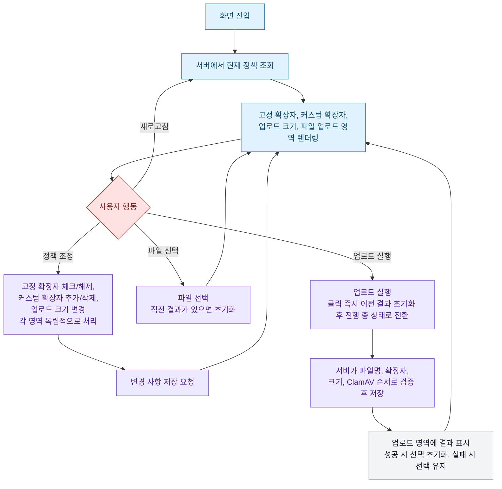

# Planning

`docs/specs/REQUIREMENTS.md`에서 확정된 요구사항을 사용자 흐름, 화면 구성, 상태와 상호작용으로 구체화한다.

## 1. 문서 목적과 범위

이 문서는 확정된 요구사항을 실제 사용 흐름과 화면 동작으로 구체화하는 기획 단계 산출물이다. 기술 구현 방식, 데이터 모델, API 설계는 다루지 않으며 다음 단계인 기술 설계 문서에서 결정한다. 이 문서의 내용이 `REQUIREMENTS.md`와 충돌하면 `REQUIREMENTS.md`가 우선한다.

## 2. 사용자 역할

인증과 소유권 개념이 없는 **단일 사용자 역할** 만 존재한다(`REQUIREMENTS.md`의 동시 편집 정합성, 원본 파일명 저장 항목 참조). 이 사용자는 한 화면에서 확장자 차단 정책과 업로드 크기 정책을 설정하고, 파일을 업로드해 정책이 실제로 적용되는지 확인한다. 관리자와 일반 사용자를 구분하는 화면이나 권한 체계는 존재하지 않는다.

## 3. 전체 사용자 흐름



1. 사용자가 화면에 진입한다.
2. 화면이 서버에서 현재 정책(고정 확장자 활성화 상태, 커스텀 확장자 목록과 개수, 업로드 최대 크기)을 조회한다.
3. 조회 결과에 따라 고정 확장자, 커스텀 확장자, 업로드 크기 정책, 파일 업로드 네 영역이 함께 렌더링된다.
4. 사용자는 다음 행동을 자유롭게 조합해 수행할 수 있다. 각 영역은 서로 독립적으로 처리되며, 한 영역이 요청을 처리하는 중에도 다른 영역을 계속 조작할 수 있다.
   - 고정 확장자를 체크하거나 해제한다.
   - 커스텀 확장자를 추가하거나 삭제한다.
   - 업로드 최대 크기를 변경한다.
5. 사용자가 파일을 선택한다. 직전 업로드 결과가 표시되어 있었다면 이 시점에 사라지고, 선택한 파일명과 크기가 표시된다.
6. 사용자가 업로드를 실행한다.
7. 서버가 검증 시점의 최신 정책을 기준으로 파일명 기본 검증, 확장자 차단 정책 검증, 파일 크기 검증, ClamAV 검사, 저장을 순서대로 처리한다. 여러 조건에 동시에 해당해도 가장 먼저 실패한 사유 하나만 결과에 반영된다.
8. 파일 업로드 영역에 이번 시도의 결과(성공 또는 첫 번째로 실패한 사유)가 표시된다. 성공하면 파일 선택이 초기화되고, 실패하면 선택한 파일이 유지되어 같은 파일로 바로 다시 시도할 수 있다.
9. 사용자는 정책을 다시 조정하거나, 실패한 경우 같은 파일을 그대로 다시 시도하거나 다른 파일로 시도할 수 있다(4~8 반복).
10. 새로고침하면 2로 돌아가 전체 정책을 다시 조회하고, 파일 선택과 직전 업로드 결과는 모두 초기화된다.

이 흐름 전체가 하나의 화면 안에서 이루어지며, 화면 전환은 발생하지 않는다.

## 4. 화면 목록과 목적

단일 화면 **"확장자 차단 및 업로드 관리"** 로 구성한다. 화면 안에 다음 다섯 영역을 둔다.

| 영역 | 목적 |
|---|---|
| 고정 확장자 섹션 | 자주 차단하는 확장자를 체크박스로 켜고 끈다 |
| 커스텀 확장자 섹션 | 임의의 확장자를 등록하고 삭제한다 |
| 업로드 크기 정책 섹션 | 업로드 허용 최대 크기를 선택한다 |
| 파일 업로드 섹션 | 실제 파일을 업로드하고 정책 적용 결과를 확인한다 |
| 전역 알림 영역 | 토스트 메시지를 표시한다(화면 전역에 걸쳐 하나의 위치) |

화면을 여러 개로 나누지 않기로 한 이유는 "정책을 바꾸고 바로 업로드해서 확인한다"는 이 서비스의 핵심 목적이 화면 이동 없이 한 화면 안에서 완결되어야 자연스럽기 때문이다.

## 5. 영역별 구성 요소와 사용자 행동

다섯 영역은 서로 독립적으로 동작한다. 한 영역이 요청을 처리하는 중이어도 다른 영역의 컨트롤은 계속 사용할 수 있으며, 화면 전체나 다른 영역을 차단하지 않는다. 예를 들어 고정 확장자 저장이 진행 중이어도 커스텀 확장자를 추가하거나 파일을 업로드할 수 있다. 다만 같은 영역 안에서는 중복 제출을 막는다(예: 커스텀 확장자 추가 요청이 진행 중일 때 추가 버튼은 비활성화되지만, 다른 항목의 삭제 버튼은 계속 사용할 수 있다). 업로드 요청은 실행 시점이 아니라 서버가 검증하는 시점의 최신 정책을 기준으로 처리되므로, 업로드 도중 다른 영역에서 정책이 바뀌어도 해당 업로드는 조회된 정책을 기준으로 정상 처리된다. 다른 탭에서 변경된 정책은 현재 화면에 자동으로 반영되지 않으며, 새로고침해야 최신 상태를 다시 조회한다.

### 5.1 고정 확장자 섹션

- 구성 요소: `bat`, `cmd`, `com`, `cpl`, `exe`, `scr`, `js` 체크박스 목록(각 항목에 `label` 연결), 저장 중 표시
- 행동: 체크, 해제
- 상태 변화
  - 클릭 즉시 화면에 반영된다.
  - 짧은 Debounce 이후 최종 상태를 서버에 저장하고, 저장 중에는 텍스트로 "저장 중" 상태를 표시한다.
  - 저장 성공 시 자동 소멸 토스트로 안내한다.
  - 저장 실패 시 서버의 최신 상태를 다시 조회해 화면을 동기화하고, 닫기 가능한 토스트로 실패 사실을 안내한다.
  - 체크 변경 후 Debounce 저장이 아직 실행되지 않았거나 완료되지 않은 상태는 미저장 상태로 관리한다.
  - 미저장 상태에서 새로고침, 탭 닫기, 브라우저 종료 등 페이지 이탈이 발생하면 `beforeunload`를 사용해 브라우저 기본 확인 대화상자를 표시한다. 대화상자 문구는 직접 제어하지 않고 브라우저 기본 안내를 사용한다.
  - 저장이 완료되면 미저장 상태를 해제하고 이탈 경고도 함께 제거한다.
  - 저장에 실패한 상태는 서버 상태로 다시 동기화하므로 미저장 변경으로 계속 유지하지 않는다.
  - 이후 애플리케이션 내부 이동이 추가되는 경우에도 미저장 상태를 확인해 이동 여부를 안내한다.
  - 이탈 시 저장 요청을 조용히 전송하는 방식에만 의존하지 않는다.
  - 판단 이유:

    > Debounce 저장 대기 중 페이지를 이탈하면 사용자가 변경사항이 저장되지 않았다는 사실을 인지하지 못한 채 상태가 유실될 수 있다고 생각했습니다. 이탈 시 저장을 조용히 시도하는 방식은 네트워크 오류가 발생해도 사용자가 실패를 확인하기 어렵기 때문에, 미저장 상태에서는 브라우저 기본 확인 대화상자를 표시하는 것이 더 안전하다고 판단했습니다.

### 5.2 커스텀 확장자 섹션

- 구성 요소: 입력 필드(`maxlength=20`), 글자 수 표시(`n/20`), 추가 버튼, 등록 개수 표시(`n/200`), 등록된 확장자 목록(각 항목에 삭제 버튼)
- 행동: 입력, 추가, 삭제
- 상태 변화
  - 입력값이 정규화 후 빈 문자열이면 추가 버튼이 비활성화된다. 버튼 비활성화 상태만으로 의미를 전달하지 않고, 입력 필드의 레이블이나 안내 문구로 입력이 필요하다는 점을 함께 제공한다.
  - 추가 클릭 시 버튼이 "추가 중..." 상태로 바뀌며 비활성화되고, 성공하면 목록에 반영되며 입력값이 초기화되고 자동 소멸 토스트로 성공을 안내한다.
  - 형식 오류, 중복, 20자 초과, 200개 초과 등 **입력값 자체의 문제**는 입력 필드 아래 인라인 오류로 표시하고 입력값을 유지하며, 해당 입력 필드로 포커스를 이동한다.
  - 네트워크 끊김이나 서버 5xx처럼 **입력값과 무관한 기술적 저장 실패**는 닫기 가능한 토스트로 안내하고 입력값을 유지한다.
  - 고정 확장자와 겹치는 값을 입력하면 커스텀 목록에 등록하지 않고 해당 고정 확장자를 자동 활성화한 뒤 자동 소멸 토스트로 안내하며, 해당 고정 확장자 항목으로 포커스 또는 시각적 강조를 이동한다. 자동 활성화 저장이 실패하면 화면 상태를 변경하지 않고 닫기 가능한 토스트로 오류를 안내한다.
  - 삭제는 확인 절차 없이 클릭 즉시 요청한다. 해당 항목의 삭제 버튼에만 로딩 상태가 표시되고, 성공하면 목록에서 제거된다(목록에서 사라지는 시각적 변화 자체가 확인이므로 별도 성공 토스트는 표시하지 않는다). 실패하면 목록을 유지한 채 닫기 가능한 토스트로 사유를 안내한다.
  - 삭제 후 포커스는 다음 항목의 삭제 버튼으로, 다음 항목이 없으면 입력 필드로 이동한다.
  - 200개 도달 시 입력창은 유지한 채 추가 버튼만 비활성화하고 "최대 200개까지 등록할 수 있습니다. 기존 항목을 삭제한 후 다시 추가해주세요."를 인라인으로 안내한다.

### 5.3 업로드 크기 정책 섹션

- 구성 요소: `1MB`, `5MB`, `10MB`, `20MB`, `50MB` 중 선택하는 입력(슬라이더 단독이 아닌 선택형 입력 또는 숫자 입력과 슬라이더를 함께 사용)
- 행동: 값 변경
- 상태 변화: 변경 시 저장을 요청한다. 성공 시 자동 소멸 토스트로 안내하고, 실패 시 이전 값으로 되돌리며 닫기 가능한 토스트로 사유를 안내한다.

### 5.4 파일 업로드 섹션

- 구성 요소: 파일 선택 입력(클릭 선택, `multiple` 속성을 사용하지 않아 한 번에 파일 하나만 선택 가능), 업로드 실행 버튼, 진행 상태 표시(불확정 스피너와 텍스트), 결과 표시 영역(직전 시도 1건)
- 행동: 파일 선택, 업로드 실행
- 상태 변화는 8절에서 상세히 다룬다.

### 5.5 전역 알림 영역

- 토스트는 알림별로 고유한 항목으로 생성되며, 새 토스트가 발생해도 기존 토스트를 대체하지 않고 함께 쌓여 각각 독립적으로 표시된다.
- 동시에 표시하는 토스트는 최대 3개까지이며, 초과하면 가장 오래된 토스트부터 제거한다.
- 각 토스트는 자신만의 표시 시간과 종료 타이밍을 독립적으로 관리하며, 하나가 사라져도 다른 토스트의 내용이나 타이머에 영향을 주지 않는다.
- 성공 토스트는 일정 시간 후 자동으로 닫힌다.
- 실패, 네트워크 오류 토스트는 충분한 시간 유지되거나 사용자가 직접 닫을 수 있다.
- 색상에만 의존하지 않고 텍스트로 상태를 명시한다.
- 등장과 소멸은 `aria-live`로 스크린 리더에 전달한다.
- 판단 이유:

  > 서로 다른 저장 작업의 결과를 사용자가 놓치지 않고 모두 확인할 수 있어야 한다고 판단해, 단일 토스트가 최신 알림으로 교체되던 방식을 알림별 독립 토스트가 쌓이는 방식으로 변경했다. 다만 무한정 쌓이면 화면을 가릴 수 있어 최대 개수를 제한했다.

## 6. 정상, 빈, 로딩, 오류, 접근 제한 상태

### 정상 상태

정책 조회에 성공해 네 영역이 각자의 최신 데이터로 렌더링된 상태다.

### 빈 상태

- 커스텀 확장자가 하나도 없으면 목록 영역에 등록된 항목이 없다는 안내 문구를 표시한다.
- 파일 업로드 섹션은 아직 업로드를 시도하지 않았거나, 사용자가 파일 선택을 직접 취소해 선택된 파일이 없는 상태로 돌아가면 결과 표시 영역 자체가 나타나지 않는다. 업로드 성공으로 앱이 파일 선택값만 초기화한 경우는 예외로, 이때는 파일이 선택되어 있지 않아도 성공 결과는 계속 표시된다(자세한 내용은 8절 참고).

### 로딩 상태

- 최초 진입 시 정책 조회가 끝나기 전까지 네 영역은 로딩 중임을 표시하고, 조회가 끝나기 전에는 저장이나 업로드 조작을 비활성화한다.
- 고정 확장자 저장, 커스텀 확장자 추가와 삭제, 업로드 진행 상태 같은 개별 액션의 로딩 상태는 각각 5절과 8절에서 정의한다.
- 최초 조회 자체가 실패하면 아직 표시할 정책 데이터가 없으므로 토스트가 아니라, 화면 콘텐츠 영역에 오류와 재시도 버튼을 인라인으로 표시한다.

### 오류 상태

각 영역별 오류 표시 방식은 5절과 8절에서 다룬다. 화면 전체를 차단하지 않고 변경 중인 요소만 로딩과 오류 상태로 처리한다.

### 권한 또는 접근 제한 상태

인증이 없으므로 별도의 권한 분기나 접근 제한 화면은 없다. 서버에 저장된 전체 파일 목록을 조회하는 기능 자체가 없으므로, 이는 "접근 제한"이 아니라 "해당 기능 없음"으로 다룬다.

## 7. 입력 검증과 오류 메시지 노출 방식

- 사용자가 직접 수정해야 하는 입력값 문제(커스텀 확장자 형식 오류, 중복, 길이 초과)는 해당 입력 필드 바로 아래에 인라인으로 표시하고, 토스트가 사라져도 오류가 해결될 때까지 계속 남아 있는다.
- 입력값과 무관한 기술적 실패(네트워크, 서버 오류)는 닫기 가능한 토스트로 표시한다.
- 검증 실패 시 문제가 발생한 입력 필드로 포커스를 이동한다.
- 오류 메시지는 색상에만 의존하지 않고 텍스트로 사유를 명시한다.

## 8. 파일 업로드 전, 진행 중, 완료, 실패 상태

### 서버 검증 순서

서버는 다음 순서로 검증하고 저장한다.

```text
파일명 기본 검증(빈 파일명, 255바이트 초과)
→ 확장자 차단 정책 검증
→ 파일 크기 검증
→ ClamAV 검사
→ 저장
```

비용이 낮고 결과가 명확한 검증부터 순차적으로 수행한다. 확장자 차단은 이번 과제의 핵심 정책이므로 파일명 기본 검증 다음으로 적용하고, 상대적으로 비용이 큰 ClamAV 검사는 파일명, 확장자, 크기 검증을 모두 통과한 파일에만 수행한다. 파일이 여러 조건에 동시에 해당하더라도 가장 먼저 실패한 사유 하나만 결과에 표시한다.

### 단계별 화면 표현

| 단계 | 화면 표현 |
|---|---|
| 업로드 전(파일 미선택) | 안내 텍스트로 파일 선택을 유도, 업로드 버튼 비활성화 |
| 업로드 전(파일 선택됨, 정상) | 선택한 파일명과 크기 표시, 업로드 버튼 활성화. 직전 결과가 표시되어 있었다면 선택 시점에 제거 |
| 업로드 전(파일 선택됨, 파일명 오류) | 255바이트를 초과하는 파일명이면 선택 직후 "파일명 길이 초과"를 인라인으로 표시하고 업로드 버튼을 비활성화(클라이언트 사전 검증). 빈 파일명은 일반적인 파일 선택 과정에서 발생하기 어려운 값이라 클라이언트 사전 검증 대상에서 제외하고 서버 최종 검증에서만 판정한다 |
| 진행 중 | 업로드 버튼을 누르는 즉시 이전 결과(성공, 차단, 실패 모두)를 제거하고 불확정 스피너와 "업로드 중..." 텍스트만 표시, 파일 선택과 업로드 버튼 비활성화로 중복 제출 방지 |
| 완료(성공) | "`{파일명}` 업로드에 성공했습니다"와 파일 크기 등 결과를 업로드 영역에 인라인으로 표시, 파일 선택을 초기화하고 업로드 버튼은 파일 미선택 상태로 복귀(파일이 선택되어 있지 않아도 이 성공 결과는 계속 표시됨) |
| 실패(검증 거부) | "`{파일명}`은 `{사유}`로 업로드할 수 없습니다" 형태로 차단된 파일명을 포함해 업로드 영역에 인라인으로 표시. 사유는 빈 파일명, 파일명 길이 초과(255바이트), 확장자 차단, 크기 초과(현재 설정된 최대 크기 포함), ClamAV 악성 탐지 중 서버가 가장 먼저 판정한 사유 하나. 선택한 파일은 유지되어 같은 파일로 다시 시도 가능 |
| 요청 크기 초과 | multipart 전체 요청이 서버 또는 배포 플랫폼의 절대 상한을 초과한 상태. 업로드 영역에 인라인으로 "요청할 수 있는 최대 크기를 초과했습니다. 더 작은 파일을 선택해주세요."를 표시. 플랫폼이 자체 413 응답을 반환해 서버의 사유 코드를 읽을 수 없는 경우에도 같은 문구로 표시. 선택한 파일은 유지되어 같은 파일로 다시 시도 가능 |
| 실패(기술적 처리 실패) | 네트워크 끊김, 서버 5xx, ClamAV 연결 실패, 저장소 저장 실패, 메타데이터 저장 실패도 동일하게 업로드 영역에 인라인으로 표시. 오프라인 상태는 "인터넷 연결을 확인한 후 다시 시도해주세요.", 타임아웃/무응답은 "서버에 연결하지 못했습니다. 잠시 후 다시 시도해주세요.", 서버 5xx나 내부 오류는 "일시적인 오류가 발생했습니다. 다시 시도해주세요." 선택한 파일은 유지 |

### 파일 선택과 결과 표시의 관계

- 사용자가 새 파일을 선택하거나 업로드 버튼을 눌러 재시도하면 동일한 파일이어도 새로운 업로드 시도로 처리되어, 직전 결과(성공, 차단, 실패 모두)가 즉시 제거된다.
- 요청이 진행되는 동안에는 이전 결과 대신 로딩 인디케이터와 "업로드 중..." 상태만 표시된다.
- 서버 응답을 받으면 최신 업로드 결과 1건으로 교체된다. 요청이 실패하면 새로 반환된 실패 사유만 표시되고, 이전 실패 사유는 남지 않는다.
- 판단 이유:

  > 동일한 파일을 다시 업로드하더라도 새로운 업로드 시도가 시작된 것이므로 이전 결과를 그대로 유지할 필요는 없다고 생각했습니다. 이전 실패 메시지와 진행 중 상태를 동시에 표시하면 현재 상태를 파악하기 어려울 수 있으므로, 업로드 버튼을 누르는 즉시 이전 결과를 제거하고 처리 중 상태만 보여주는 방식이 적절하다고 판단했습니다.

- 사용자가 파일 선택을 직접 취소해 선택된 파일이 없는 상태로 돌아가면, 선택 정보와 결과 표시 영역이 함께 초기화되어 결과 표시 영역이 다시 나타나지 않는다.
- 업로드가 성공하면 앱이 파일 선택값만 초기화한다. 이 경우 파일이 선택되어 있지 않아도 성공 결과는 계속 표시되며, 같은 파일을 다시 업로드하려면 새로 선택해야 한다. 성공한 파일을 그대로 두면 같은 파일이 실수로 반복 업로드될 수 있기 때문이다.
- 업로드가 검증 거부되거나 기술적으로 실패하면 선택한 파일이 유지되어, 사용자는 정책 변경이나 네트워크 복구 후 같은 파일로 바로 다시 시도할 수 있다.
- 여러 시도 결과를 누적한 이력 목록은 만들지 않는다.
- 업로드가 차단되거나 실패하면 파일 입력 또는 오류 안내 영역으로 포커스를 이동한다.
- 자동 재시도는 적용하지 않으며, 사용자가 직접 다시 시도한다.
- 새로고침하면 파일 선택과 결과 표시 영역이 모두 초기화된다.

## 9. 데스크톱과 모바일에서의 주요 차이

- 별도의 전용 레이아웃이나 다수의 미디어 쿼리는 두지 않는다. 화면 너비에 따라 요소가 유동적으로 축소되고, 고정/커스텀 확장자 목록은 `flex-wrap`으로 자동 줄바꿈된다.
- 파일 선택은 클릭 선택만 지원하므로, 모바일에서는 운영체제가 제공하는 기본 파일 선택 UI를 그대로 사용하며 별도 대응이 필요하지 않다.
- 작은 화면에서도 가로 스크롤 없이 추가, 삭제, 업로드를 수행할 수 있어야 한다.

## 10. 키보드 탐색과 접근성

- 모든 체크박스와 입력 필드에 `label`을 명시적으로 연결한다.
- 체크, 추가, 삭제, 업로드는 `button`, `input` 등 의미에 맞는 시맨틱 요소로 구현하고, 모든 기능을 키보드만으로 조작할 수 있다.
- Tab 이동 순서는 DOM 순서와 일치시키며 양수 `tabindex`는 사용하지 않는다. `:focus-visible`로 키보드 포커스를 표시한다.
- 검증 실패, 업로드 차단뿐 아니라 네트워크 오류, 서버 오류, 저장 실패 같은 기술적 처리 실패 시에도 관련 입력 필드나 안내 영역으로 포커스를 이동한다. 저장 성공이나 로딩 완료처럼 흐름이 끊기지 않는 경우에는 포커스를 강제로 이동하지 않는다.
- 아이콘만 있는 삭제 버튼에는 접근 가능한 이름을 제공한다.
- 동적 상태 변경(토스트 등장, 저장 중, 업로드 결과)은 필요한 영역에만 `aria-live`를 적용해 전달한다.

## 11. 화면 간 이동 조건

단일 화면 구조이므로 화면 간 이동은 없다.

## 12. 요구사항과 화면 간 추적 관계

| REQUIREMENTS.md 항목 | 이 문서의 반영 위치 |
|---|---|
| 고정 확장자 | 5.1 |
| 커스텀 확장자, 제한 초과 시 UX, 빈 입력 처리, 연속된 마침표 처리 | 5.2 |
| 고정 확장자와 커스텀 확장자 중복 | 5.2 |
| 업로드 파일 크기와 개수 제한 | 5.3, 5.4, 8 |
| 업로드 파일명 길이 제한 | 3, 8 |
| 파일 업로드, 파일 시그니처 검증, 업로드 중 정책 변경 | 3, 5.4, 8 |
| 대소문자 처리, 복합 확장자, 확장자 없는 파일과 숨김 파일 | 8(정책 판정 결과 표시 방식에 포함, 세부 판정 로직은 기술 설계로 위임) |
| 차단 메시지 | 8 |
| 저장 실패 처리 | 5.1, 5.2, 5.3 |
| 네트워크 오류 처리 | 5.5, 7, 8 |
| 접근성 | 10 |
| 반응형 | 9 |
| 동시 편집 정합성 | 2, 3, 5 |
| 로그와 모니터링, 정책 변경 이력 | 14(화면에는 노출하지 않는다) |
| MIME 타입 검증, 원본 파일명 저장 | 화면에 직접 노출되지 않는 서버 내부 정책이므로 이 문서에서 다루지 않으며, 기술 설계에서 반영한다 |

## 13. 기술 설계 단계로 넘겨야 할 결정 사항

- API 엔드포인트, 요청/응답 스키마
- Debounce 시간, 토스트 자동 소멸 시간 등 구체적인 수치
- 데이터 모델, 테이블 스키마, 인덱스
- 정규화된 확장자 길이와 파일명 길이의 구체적인 문자 계산 방식(유니코드 처리 포함, `REQUIREMENTS.md`에서 이미 기술 설계로 위임)
- ClamAV 연동 방식과 장애 처리 구현
- 정책 조회 실패 시 재시도 정책(자동 재시도 여부, 백오프)

## 14. 기획 범위에서 제외한 항목

- 정책 변경 이력 조회 UI(`REQUIREMENTS.md`에서 후순위로 확정됨)
- 로그와 모니터링을 위한 별도 조회 화면이나 대시보드
- 업로드 이력을 누적해서 보여주는 목록 화면
- 사용자 인증, 권한별 화면 분리
- 드래그앤드롭 업로드, 다중 파일 업로드
- 삭제 확인 모달, 삭제 실행취소
